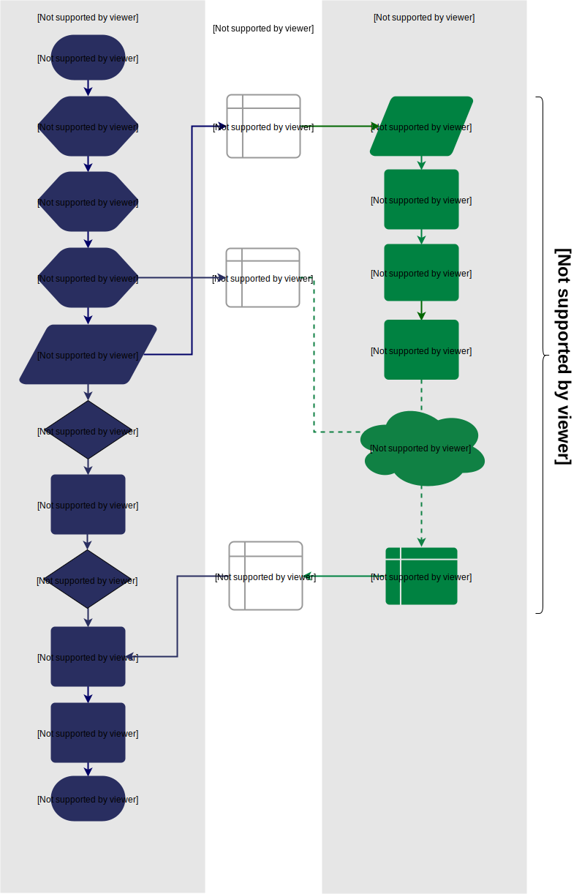
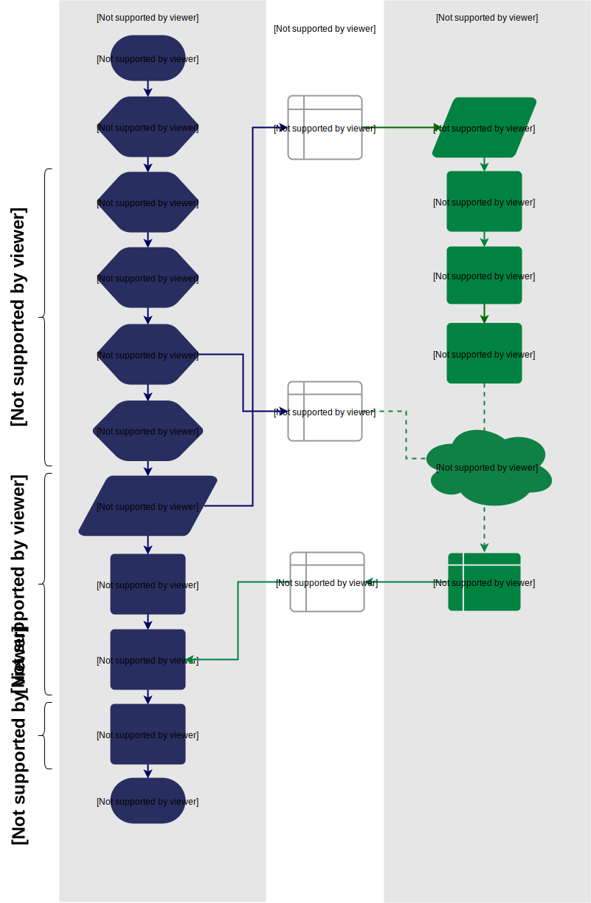
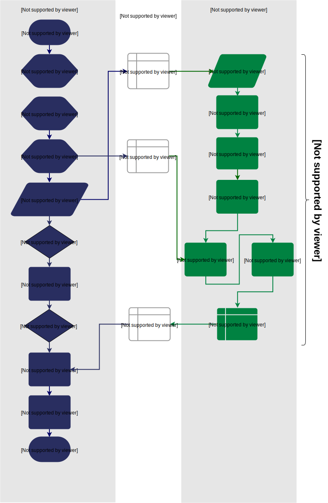

Benchmarking your projects
======================================================
Now you've got the tools you need to start writing your own Reconfigure.io programs, you are most likely interested in a way to see how long it's taking the FPGA instance to process your data, after all, performance is what it's all about! Luckily, we use Go for everything, so benchmarking is built-in to the testing framework we have on hand. **In this guide we'll take a look at how to benchmark Reconfigure.io programs and look at the two benchmark options we provide in our template: first, measuring how long it takes the FPGA to process some data, and second, getting a full system benchmark for the host and FPGA combined. These can be used as starting points for you to generate the benchmarks you need.** Benchmarks are useful for several reasons: to compare performance with the same data processing being done on just a CPU, or other hardware acceleration platforms, and also benchmarks give us a means to track progress between design iterations as we make changes to optimize our programs.

What we will do
----------------
* Discuss our various benchmark options and look at our template benchmarking structure.
* Look at the structure of an FPGA-side benchmark.
* Look at the structure of a full system benchmark.
* See how to quickly add a benchmark to an example using our template.
* Try out running some benchmarks at deployment

Overview
------------------------
Reconfigure.io programs contain code for a whole FPGA instance: a Go program for the FPGA and at least one other to be run on the host CPU. The host is responsible for collecting/defining sample data, creating the required space in shared memory, passing pointers to the FPGA and starting the FPGA running. So, there's a certain amount of set up and tear down work required in our programs on either side of the main work of the FPGA.

We can use Go's benchmarking framework to measure the performance of our Reconfigure.io programs in terms of the speed at which they can process data. **Go benchmarking is designed to run through a defined loop of code a number of times until it can report a stable benchmark for the process**. The framework uses a timer which can be started, reset and stopped, so we can decide at which bits of our data processing we want to measure using these controls.

In standard Go, benchmarking is part of the testing framework, so the benchmark would be defined within the project's ``main_test.go`` and you would run the benchmark with ``go test -bench=.``. **When benchmarking Reconfigure.io programs you will be using our command line tool** ``reco`` **rather than** ``go test -bench=.`` **, and rather than including the benchmarking code itself in the** ``main_test.go`` **file, you’ll write a whole new host-side command so you can run the benchmark during deployment to get accurate results from the actual hardware.**

We've included the basics for two different benchmarks in our template, so let's look at those now:

FPGA-side benchmark
^^^^^^^^^^^^^^^^^^^
The Go testing framework runs through a loop of code over and over again, increasing the number of repeats – ``b.N`` – until it lasts long enough to be timed reliably. While developing our programs we're most interested in the speed at which the FPGA gets through our data, so a benchmark targeting just that is really useful. We'll also look at a full system benchmark later, which will include the slowest parts of the process in its results – writing to and reading from memory. If we want to benchmark just the FPGA-side code we need to pass this incrementing value, ``b.N``, *to* the FPGA, to be used to set the size of the sample data. if we do this, we know ``b.N`` iterations of the FPGA processing loop will be run, so we can get an accurate result. We can |reset| just before starting the FPGA running so we just measure the FPGA runtime and not the time it takes to transfer data to and from memory. Here's how this looks in a flow diagram:

  Flow diagram showing benchmarking the FPGA runtime

And here is our template code for an FPGA benchmark:

.. code-block:: Go
  :linenos:
  package main

  import (
  "encoding/binary"
  "fmt"
  "testing"

  "github.com/ReconfigureIO/sdaccel/xcl"
  )

  func BenchmarkKernel(world xcl.World, b *testing.B) {
    // Get our program
    program := world.Import("kernel_test")
    defer program.Release()

    // Get our kernel
    krnl := program.GetKernel("reconfigure_io_sdaccel_builder_stub_0_1")
    defer krnl.Release()

    // We need to create an input the size of B.N, so that the kernel
    // iterates B.N times
    input := make([]uint32, b.N)

    // create some sample input data, as an example here we're just filling the
    // input variable with incrementing uint32s
    for i, _ := range input {
     input[i] = uint32(i)
    }

    // Create input buffer
    inputBuff := world.Malloc(xcl.ReadOnly, uint(binary.Size(input)))
    defer inputBuff.Free()

    // Create variable and buffer for the result from the FPGA, in this template
    // we're assuming the result is the same size as the input
    result := make([]byte, b.N)
    outputBuff := world.Malloc(xcl.ReadWrite, uint(binary.Size(result)))
    defer outputBuff.Free()

    // Write input buffer
    binary.Write(inputBuff.Writer(), binary.LittleEndian, &input)

    // Set arguments – input buffer, output buffer and data length
    krnl.SetMemoryArg(0, inputBuff)
    krnl.SetMemoryArg(1, outputBuff)
    krnl.SetArg(2, uint32(len(input)))

    // Reset the timer so that we only benchmark the runtime of the FPGA
    b.ResetTimer()
    krnl.Run(1, 1, 1)
  }

  func main() {
    // Create the world
    world := xcl.NewWorld()
    defer world.Release()

    // Create a function that the benchmarking machinery can call
    f := func(b *testing.B) {
     BenchmarkKernel(world, b)
    }

    // Benchmark it
    result := testing.Benchmark(f)

    // Print the benchmark result
    fmt.Printf("%s\n", result.String())
  }

Full system benchmark
^^^^^^^^^^^^^^^^^^^^^
We can also use Go's benchmarking framework to measure how long it takes for our full sample dataset to be processed, in this case, the loop we want to run through ``b.N`` iterations is as follows:

* the host writes sample data to memory
* then passes the input and results pointers to the FPGA
* the FPGA processes the sample data
* and passes it back to shared memory
* then the host fetches the results

In this scenario there's some setup and teardown that we don't want to include in the benchmark. Here's a flow diagram to show how this can work:

  Flow diagram showing benchmarking the full system

Here's our template for a full system benchmark, note that we're taking the input data size as a command line argument so you can run multiple benchmarks for different data widths:

.. code-block:: Go
    :linenos:
    package main

    import (
    "encoding/binary"
    "fmt"
    "log"
    "os"
    "strconv"
    "testing"

    "github.com/ReconfigureIO/sdaccel/xcl"
    )

    func main() {
      // take the first command line argument and use as the data size for the benchmark
      input := os.Args[1]

      // convert the string argument to an int
      nInputs, err := strconv.Atoi(input)
      if err != nil {
       // handle error
       fmt.Println(err)
       os.Exit(2)
      }

      // initialise a new state using our specified input size and warm up
      state := NewState(nInputs)
      defer state.Release()

      // run the benchmark
      log.Println()
      log.Println()
      log.Printf("Time taken to pass, process and collect an array of %v integers: \n", nInputs)
      log.Println()

      result := testing.Benchmark(state.Run)
      fmt.Println(result)
    }

    type State struct {
      // Everything that needs setting up - kernel, input buffer, output buffer, input var, result var.
      world      xcl.World
      program    *xcl.Program
      krnl       *xcl.Kernel
      inputBuff  *xcl.Memory
      outputBuff *xcl.Memory
      input      []uint32
      output     []uint32
    }

    func NewState(nInputs int) *State {
      w := xcl.NewWorld()          // variable for new World
      p := w.Import("kernel_test") // variable to import our kernel
      size := uint(nInputs) * 4    // number of bytes needed to hold the input and output data

      s := &State{
       world:      w,                                                      // allocate a new world for interacting with the FPGA
       program:    p,                                                      // Import the compiled code that will be loaded onto the FPGA (referred to here as a kernel)
       krnl:       p.GetKernel("reconfigure_io_sdaccel_builder_stub_0_1"), // Right now these two identifiers are hard coded as an output from the build process
       inputBuff:  w.Malloc(xcl.ReadOnly, size),                           // constructed an input buffer as a function of nInputs
       outputBuff: w.Malloc(xcl.ReadWrite, size),                          // In this example our output will be the same size as our input
       input:      make([]uint32, nInputs),                                // make a variable to store our input data
       output:     make([]uint32, nInputs),                                // make a variable to store our results data
      }

      // Seed the input array with incrementing values
      for i, _ := range s.input {
       s.input[i] = uint32(i)
      }

      //To avoid measuring warmup cost of the first few calls (especially in sim)
      const warmup = 2
      for i := 0; i < warmup; i++ {
       s.feedFPGA()
      }

      return s
    }

    // This function will calculate the benchmark, it will run repeatedly until it achieves a reliable result
    func (s *State) Run(b *testing.B) {
      for i := 0; i < b.N; i++ {
       s.feedFPGA()
      }
    }

    // This function frees up buffers and released the World an program used to interact with the FPGA
    func (s *State) Release() {
      s.inputBuff.Free()
      s.outputBuff.Free()
      s.program.Release()
      s.world.Release()
    }

    // This function writes our sample data to memory, tells the FPGA where it is, and where to put the result and starts the FPGA runnings
    func (s *State) feedFPGA() {
      // write input to memory
      binary.Write(s.inputBuff.Writer(), binary.LittleEndian, &s.input)

      s.krnl.SetMemoryArg(0, s.inputBuff)    // Send the location of the input data as the first argument
      s.krnl.SetMemoryArg(1, s.outputBuff)   // Send the location the FPGA should put the result as the second argument
      s.krnl.SetArg(2, uint32(len(s.input))) // Send the length of the input array as the third argument, so the FPGA knows what to expect

      // start the FPGA running
      s.krnl.Run(1, 1, 1)

      // Read the results into our output variable
      binary.Read(s.outputBuff.Reader(), binary.LittleEndian, &s.output)

      log.Printf("Input: %v ", s.input)
      log.Printf("Output: %v ", s.output)
    }

Get started
-----------
FPGA-side benchmark
^^^^^^^^^^^^^^^^^^^
To add an FPGA-side benchmark to an existing example, copy the template benchmark from [HERE] (or here: if you've forked our tutorial materials) and place it into your project's `cmd` directory. It should look like this::

.. code-block:: shell

    ├── cmd
    │   └── test-my-project
    │       └── main.go
    │   └── bench-FPGA
    │       └── main.go
    ├── main.go
    ├── main_test.go

Then , open ``cmd/bench-FPGA/main.go and make sure the input data section of the benchmark to be correct for your project, you can make changes to the sample data here, but the size needs to be set to our incrementing value ``b.N`` so the benchmarking framework can ramp up the number of times the processing loop of the FPGA side is run to get an accurate result. Our template uses an array of ``uint32s`` of size ``b.N``. If that works for your project you can leave it how it is.

You can then run the benchmarks during deployment once the example is built. To do this, create a build by running (you can enter whatever helpful message you want):

.. code-block:: shell

   reco build run -m "benchmark the FPGA run time"

Then you can check your |dashboard| to see when the build is complete. To run the benchmark, first copy your build ID, with from your dashboard or by viewing the build list for your project, by running ``reco build list``, and then run the benchmark during a deployment:

.. code-block:: shell

   reco deploy run <build_ID> bench-FPGA

.. admonition:: Benchmarks during simulation
   It is possible to run benchmark commands during a hardware simulation, but the results you will see will not give a good representation of how the program will perform on hardware.

.. todo::
   Add links to benchmark templates once they are released

Full system benchmark
^^^^^^^^^^^^^^^^^^^^^
To add a full system benchmark to an existing example just copy the template from [HERE] (or here: if you've forked our tutorial materials) and place them into your project's `cmd` directory. It should look like this::

.. code-block:: shell

    ├── cmd
    │   └── test-my-project
    │       └── main.go
    │   └── bench-full
    │       └── main.go
    ├── main.go
    ├── main_test.go

Then , open ``cmd/bench-full/main.go and make sure the data being sent to the FPGA is correct for your project: uur template uses an array of incrementing``uint32s`` of size set by the value provided from the command line when a deployment is run. If that works for your project you can leave it how it is. To compare with the FPGA-side benchmark described above, this time, the incrememnting value ``b.N`` ramping up the number of times the function ``feedFPGA`` is run, until it's gets accurate timing for the whole process.

You can then run the benchmark during deployment once the example is built. To do this, create a build by running (you can enter whatever helpful message you want):

.. code-block:: shell

   reco build run -m "benchmark the full system"

Then you can check your |dashboard| to see when the build is complete. To run the benchmark, first copy your build ID, with from your dashboard or by viewing the build list for your project, by running ``reco build list``, and then run the benchmark during a deployment, replacing <build_ID> for the build ID you just copied, and <input_size> for whatever input array size you want to benchmark:

.. code-block:: shell

   reco deploy run <build_ID> bench-FPGA <input_size>

.. admonition:: Benchmarks during simulation
   It is possible to run benchmark commands during a hardware simulation, but the results you will see will not give a good representation of how the program will perform on hardware.

.. todo::
   Add links to benchmark templates once they are released

How to ...
----------
Benchmark a simple example
^^^^^^^^^^^^^^^^^^^^^^^^^^
Let's have a go at benchmarking our multiply-array example from :ref:`tutorial 3 <struture>`.
Scale up a design and see benchmark improvements
^^^^^^^^^^^^^^^^^^^^^^^^^^^^^^^^^^^^^^^^^^^^^^^^
Change a the FPGA-side benchmark to measure different parts of the process
^^^^^^^^^^^^^^^^^^^^^^^^^^^^^^^^^^^^^^^^^^^^^^^^^^^^^^^^^^^^^^^^^^^^^^^^^^
Probably the easiest way to see how this works, as usual, is to look at some very simple example code. Let's take the array multiplication example from the last tutorial. Our completed example is |multiply|, which includes benchmark commands for the host, but if you completed the last tutorial the following steps will guide you through adding this benchmark to your version.

As we've done in previous tutorials, let's look at a flow diagram to see what we want the host and FPGA to do:

   Flow diagram showing benchmarking the FPGA

From this we can see that by resetting and stopping the benchmarking timer, we will end up with a benchmark figure for once round the FPGA processing loop.

Now let's check you've got the latest version of our tutorial materials – |tutorials_version|. Open a terminal and navigate to where you cloned your fork (probably ``$GOPATH/src/github.com/<your-github-username>/tutorials``) and run::

    git describe --tags

If you have a different version, please run

.. subst-code-block::

    git fetch upstream
    git pull upstream master
    git checkout |tutorials_version|

In tutorial 3 you created your multiply array example within a branch called `multiply`, so let's check that out

.. subst-code-block::

    git checkout multiply

Now head to your version of the multiply-array example – it's probably here: ``$GOPATH/src/github.com/<your-github-username>/tutorials/multiply-array`` – and we'll copy our two benchmarking templates across to this example:

.. code-block: shell

   cd multiply-array/cmd
   cp -r template/cmd/bench

.. |multiply| raw:: html

   <a href="https://github.com/ReconfigureIO/tutorials/tree/master/multiply-array" target="_blank">here</a>

.. |reset| raw:: html

   <a href="https://golang.org/pkg/testing/#B.ResetTimer" target="_blank">reset the benchmarking timer</a>

.. |dashboard| raw:: html

   <a href="https://app.reconfigure.io/dashboard" target="_blank">dashboard</a>
