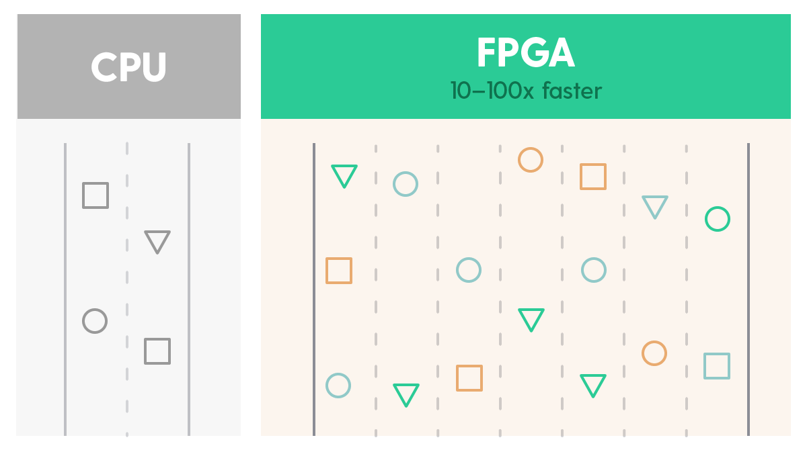

.. _concurrency:

Concurrency, Parallelism and Go
================================
FPGAs contain thousands of reprogrammable logic blocks that you can use to perform many processes at the same time. When writing your code you can take advantage of this parallel architecture by breaking problems down into processes that *can* run at the same time – this is known as **concurrency**.

What is concurrency?
--------------------
A concurrent program is made up of well structured self-contained processes, which, if needed, could run at the same time. This is slightly more complex than it might seem at first because generally we don't want *everything* to happen simultaneously – where needed, we can design serialization into our concurrent processes. Take the example of image processing. It's easy to see how the time taken to process an image could be reduced by breaking the image down into pieces and creating workers to process each piece, all at the same time (in parallel). But, once this has happened, the image needs to be put back together again. This step can only happen after the processing of each image segment has finished, therefore, serially.

Another feature of concurrent programming is that the resulting code has a higher degree of complexity compared to the non-concurrent version – more complex but potentially much faster. Take the image processing example from above, a non-concurrent solution would just involve one worker processing the whole image, pixel by pixel. But the concurrent program involves breaking the image up and passing each portion to one of several workers for processing, and then having the workers place the results somewhere so the final image can be pieced back together – a more complex yet more economical result.

Go's concurrency features
--------------------------
As well as being one of the most popular high-level languages, and a relatively easy one to pick-up, Go has a few key features that make expressing concurrency a simple process – areas a lot of languages leave to libraries.

**Goroutines** are lightweight threads that allow you to express syntactically where you want to introduce concurrency into your program.

For instance, take this spin function that just prints numbers forever. If we were to call it like a normal function, it would run
forever and subsequent statements would never run. However, if we run it with a `go` statement, a new lightweight thread is spawned that will run forever in the *background* while the main thread continues to execute::

  func spin(){
      for i := 0; ; i++ {
          print(i)
      }
  }

  func main(){
      // doesn't block
      go spin()
      ...
  }

This isn't a very interesting example, as it's just a background thread, but we can use another feature of Go - channels – to communicate and synchronize across goroutines.

**Channels** are bounded blocking FIFOs that you can pass around just like any other value. There is syntax support for sending to and receiving from a channel. It's pretty common in Go to use a channel where you would either share memory or use locks in another language.

This example spawns a goroutine to send to a channel, and then the caller waits to receive the value from the channel, and then prints it::

  func send() <-chan int{
      c := make(chan int)
      go func(){ c <- 1 }
      return c
  }

  func main(){
      c := send()
      print(<-c)
  }

**Select statements** are the last concurrency feature. They allow the runtime to choose between multiple possible channel actions, either sending or receiving. Select statements implement 'mutual exclusion' which allows us to introduce serial aspects to our concurrent programs::

  select {
  case a := <-c1:
      print(a)
  case b := <-c2:
      print(b)
  }
