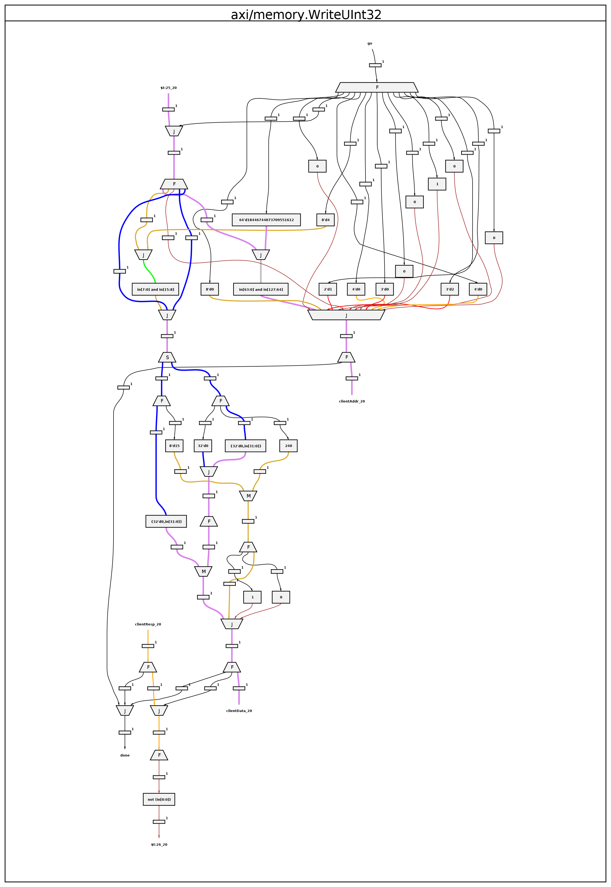
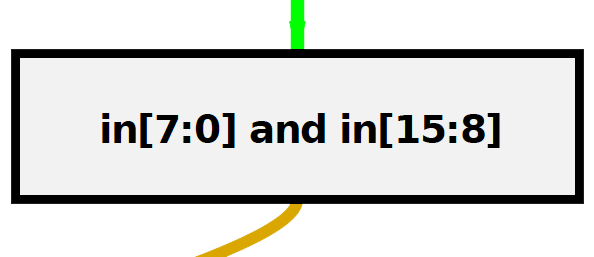
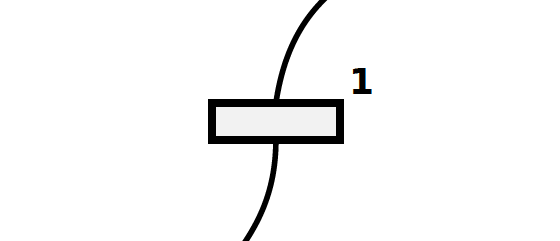
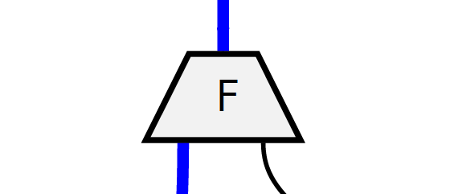
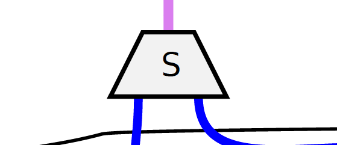
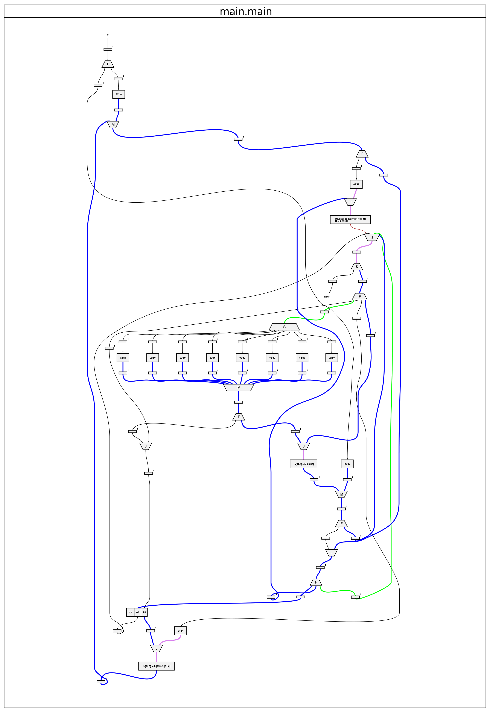
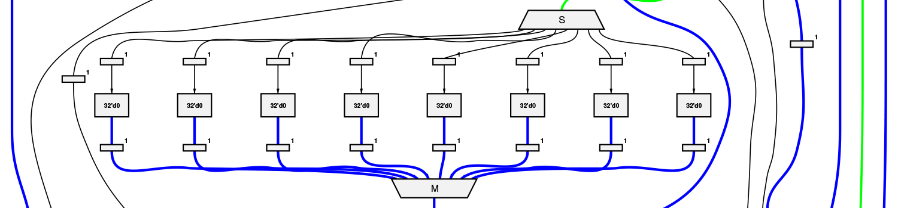
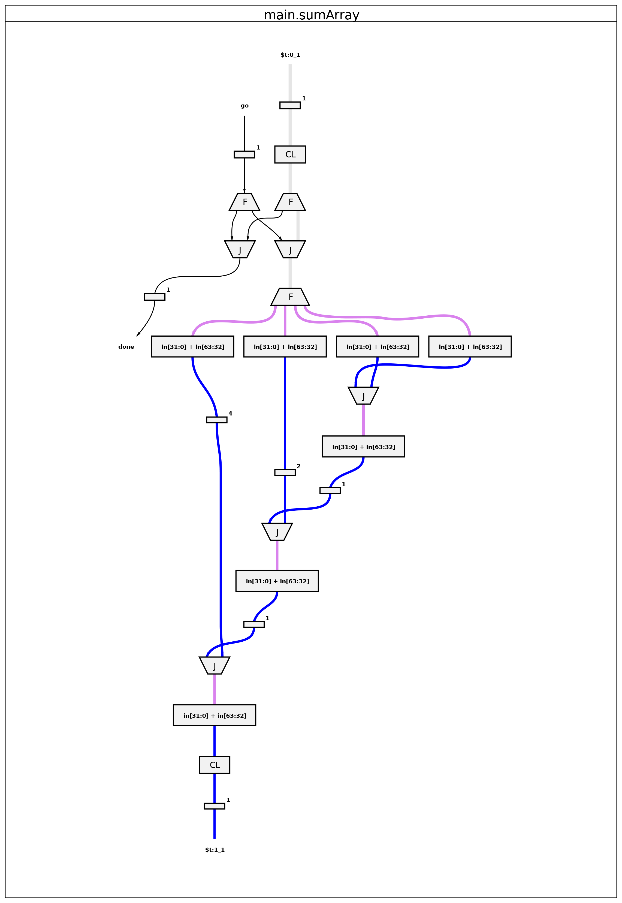

.. _optimize:

Optimizing your projects
============================
In this section we're going to look at optimizing your projects. Select an option below to jump to a section:

* :ref:`graphs`
* :ref:`reports`

.. _graphs:

Dataflow graphs
-------------------------------------------
We're going to look at how to optimize your code by analyzing dataflow graphs. When you start creating your own programs you'll probably want to start introducing more concurrency to make better use of the parallel processing capabilities of the FPGA. **Using dataflow graphs for code optimization is an experimental feature. It’s quite a complex process but gives an interesting insight into how Reconfigure.io works. We're currently working on automating this optimization stage, at which point, graph generation will no longer be part of our workflow.** Here's what we'll do:

* Talk about why graphs are useful
* Look at the basic structure of our graphs, what the different node types represent
* Generate a graph for a simple function that adds some numbers using a ``for`` loop
* Identify ways to optimize that function, generate a new graph, and see the differences

Why use graphs?
^^^^^^^^^^^^^^^
Our compiler takes your code through several processes to get it into a suitable format for programming an FPGA. The first step is to convert it to a language called |teak|.

Teak is a hardware description dataflow language, designed to be easily translated into other hardware description languages. What sets Teak apart from other forms is that it is displayed as a graph rather than a sequential list of instructions. In the Teak model, each node in the graph is an independent process operating on data flowing through the |edges|. What this gives us is a model of computation that is parallel by default, where sequential dependencies are expressed via dataflow. Teak graphs give us a representation of how our Go code will be translated onto the FPGA circuitry. This is very valuable because, at the two ends of the process, the solution looks very different.

**So, our goal is to write concurrent Go code to take advantage of the FPGA's parallel hardware, and we can use Teak graphs to identify where this parallelism can be increased by changing the way the original code is structured.**

How are the graphs structured?
^^^^^^^^^^^^^^^^^^^^^^^^^^^^^
Teak graphs can be many pages long, with a page for each function used in your code. The complexity of each page depends on the complexity of the function. Here's an example, it's the graph for the ``axi/memory.WriteUInt32`` function used in our addition example:

    Dataflow representation of the axi/memory.WriteUInt32 function

.. note::
   ``reco graph gen`` will generate content for every function that reaches our compiler, so some pages in the output may be for functions you haven't used.

There are various **node** types, which we will look at below, connected by lines of varying color. The black lines represent control circuits, stop, go etc., so there's no data flowing there. The colored lines distinguish unique data widths.

Each node has **ports** for connectivity. Input ports are at the top and output ports at the bottom. Some node types will have multiple inputs or outputs depending on their function.

Node types
~~~~~~~~~~

+------------+--------------------------------------------------------------------------------------------------------------------------------------------------------------------------------------------------------------------------------------------------------------+
| |operator| | **Operator** – The most fundamental node type is the operator. As you might expect, it's responsible for operating on data. Anywhere you would use an arithmetic or logical operator in Go, you can expect it to be represented as an operator node in Teak. |
+------------+--------------------------------------------------------------------------------------------------------------------------------------------------------------------------------------------------------------------------------------------------------------+

**Latch** – A latch is inserted in the Teak model to break up operations into manageable chunks for the FPGA circuitry. A latch introduces a 1 clock delay into the system. Latches hold data, allowing operators to pass data between each other.

**Fork** – A fork indicates a split in the circuit. Forks are important for concurrency, because they can pass data to two or more nodes at the same time.

**Join** – A join shows where data/control paths are synchronized and concatenated.

**Steer** – A steer takes a single input and sends to multiple outputs, choosing outputs is based on the input control value assigned to the data. They act as data-dependent de-multiplexers.

**Merge** – A merge multiplexes multiple, concurrent input data or control streams on a first-come-first-served basis.

**Arbitrate** – An arbiter uses a scheduling algorithm to decide the order it passes on its independent inputs.

Let's get started
^^^^^^^^^^^^^^^^^
First, let's check you're using the latest version of our tutorial materials. Open a terminal and navigate to where you cloned your fork – ``$GOPATH/src/github.com/<your-github-username>/tutorials`` and run::

    git describe --tags

If you have a version other than |tutorials_version|, please run

.. subst-code-block::

    git fetch upstream
    git pull upstream master
    git checkout |tutorials_version|

So, we're going to start with a simple example that could do with some optimization so you can see how it works. ``tutorials/bad-graph`` contains a single main.go file with just one function that takes an array of 8 integers and sums them together using a for loop::

  package main

  func main() {
      var array [8]int
      sum := 0
      for i := 0; i < 8; i++ {
          sum = array[i] + sum
      }
  }

Generate a graph
^^^^^^^^^^^^^^^^
We can use ``reco`` to generate a graph for this function, but first we need to set a project to work within - all ``reco`` simulations, builds, deployments and graphs are associated with a project so you can easily find, list and view the various elements later. Open a terminal and navigate to ``tutorials/bad-graph``. Create and set a project called ``graphs`` by running the following::

  reco project create graphs
  reco project set graphs

Now you can generate the graph for our bad example by running ``reco graph gen``::

  $ reco graph gen
  preparing graph
  done. Graph id: <graph_ID>
  archiving
  done
  uploading ...
  done
  <graph_ID>

  Graph submitted. Run 'reco graph list' to track the status of your graph
  Once the graph has been completed run 'reco graph open <graph_ID>' to view it

Copy the unique graph ID to open the graph in your default PDF viewer::

  reco graph open <graph_ID>

It should look like this:

Looking at the graph, you can see it's pretty complex, there's a lot going on. But if we simply try to trace the various branches from ``go`` (at the top) to ``done`` (middle, right hand side), you can see that some of the branches are long and have quite a few nodes, including several latches, which increase the time the whole thing takes. And due to the use of a ``for`` loop in the code, some of these branches are looping too.

A sign of good parallelism is when a graph is wide, with multiple unconnected operations appearing horizontally. So, in this example, the only really parallel bit is in the middle, which corresponds to where the array is accessed in the code:

If we used this code to program an FPGA, we would not be making good use of it's parallelism. What we need to do is think of ways to change the original code to make better use of the parallel circuitry.

More parallelism
^^^^^^^^^^^^^^^^
Taking away the for loop and summing the bits of the array together, in one go, is a good way to do this. Let's try that, and see what the graph looks like.

The improved function is in ``tutorials/good-graph``. Again there's just a single main.go file in there containing one function::

  package main

    func sumArray(array [8]int) int {
  	val := array[0] + array[1] + array[2] + array[3] + array[4] + array[5] + array[6] + array[7]
  	return val
  }

Navigate to ``tutorials/good-graph`` and generate a new graph by running ``reco graph gen``::

  $ reco graph gen
  preparing graph
  done. Graph id: <graph_ID>
  archiving
  done
  uploading ...
  done
  <graph_ID>

  Graph submitted. Run 'reco graph list' to track the status of your graph
  Once the graph has been completed run 'reco graph open <graph_ID>' to view it

Again, copy the unique graph ID to open the graph::

  reco graph open <graph_ID>

As you can see, it's a lot clearer what's going on here. There is the short ``go`` to ``done`` journey on the left, representing the simple function, and the elements of the array are clearly being summed together as you look down the right hand side of the graph. Clarity is usually a good sign that the code is designed well for achieving a high degree of parallelism.

Optimizing your own code with graphs
^^^^^^^^^^^^^^^^^^^^^^^^^^^^^^^^^^^^
Analyzing Teak dataflow graphs is complex. For this reason, we suggest that when it comes to optimizing your own code, you should break out small functions from your overall code to get a clearer picture of what's going on. Taking the example from our coding style guide: if ``(a * b) + c`` is in an inner loop of your program, breaking it out into the function below will help you see its performance in isolation as it will appear as a separate page in the graph output::

  func MultiplyAndAdd(a uint, b uint, c uint) uint {
     return (a * b) + c
  }

Once you have optimized these smaller functions you can embed them back into your wider code to improve the overall parallelism of the program.

We have a section on our |support| where you can post your own generated graphs to get optimization help from the Reconfigure.io team.

.. |teak| raw:: html

   <a href="http://apt.cs.manchester.ac.uk/projects/teak/" target="_blank">Teak</a>

.. |edges| raw:: html

   <a href="https://en.wikipedia.org/wiki/Graph_theory" target="_blank">edges</a>

.. |support| raw:: html

   <a href="https://community.reconfigure.io/c/optimization-support" target="_blank">forum</a>

.. _reports:

Build reports
-----------------------
Once a build image is complete you can access a build report to find out how much of the FPGA's available resources your design is using. In this section we'll cover the following:

* How to view reports
* The structure of reports – highlighting key useful elements
* A look at what each component of the FPGA is for

View a build reports
^^^^^^^^^^^^^^^^^^^^
Build reports are generated when a build image completes successfully. The information included in build reports is broken down into the various elements that make up the FPGA: Configurable logic blocks (LUTs and Registers), DSP blocks, and RAM.

To view a build report, find the build ID you're interested in, either by checking your recent activity on your |Dashboard| or by viewing the build list for your project: from the project location on your local machine enter::

  reco build list

Then, to view a report, copy a build ID and run::

  reco build report <build_ID>

Report structure
^^^^^^^^^^^^^^^^
Here's an example report from our Histogram-array example:

.. code-block:: shell
  :linenos:
  :emphasize-lines: 76, 77, 78, 79, 80

  Build Report: {
    "partName": "xcvu9p-flgb2104-2-i",
    "lutSummary": {
      "used": 5769,
      "detail": {
        "lutLogic": {
          "used": 5272,
          "available": 1182240,
          "description": "LUT as Logic",
          "utilisation": 0.45
        },
        "lutMemory": {
          "used": 497,
          "available": 591840,
          "description": "LUT as Memory",
          "utilisation": 0.08
        }
      },
      "available": 1182240,
      "description": "CLB LUTs",
      "utilisation": 0.49
    },
    "moduleName": "reconfigure_io_sdaccel_builder_stub_0_1",
    "regSummary": {
      "used": 12752,
      "detail": {
        "regLatch": {
          "used": 0,
          "available": 2364480,
          "description": "Register as Latch",
          "utilisation": 0
        },
        "regFlipFlop": {
          "used": 12752,
          "available": 2364480,
          "description": "Register as Flip Flop",
          "utilisation": 0.54
        }
      },
      "available": 2364480,
      "description": "CLB Registers",
      "utilisation": 0.54
    },
    "blockRamSummary": {
      "used": 17,
      "detail": {
        "blockRamB18": {
          "used": 32,
          "available": 4320,
          "description": "RAMB18",
          "utilisation": 0.74
        },
        "blockRamB36": {
          "used": 1,
          "available": 2160,
          "description": "RAMB36/FIFO",
          "utilisation": 0.05
        }
      },
      "available": 2160,
      "description": "Block RAM Tile",
      "utilisation": 0.79
    },
    "dspBlockSummary": {
      "used": 0,
      "available": 6840,
      "description": "DSPs",
      "utilisation": 0
    },
    "ultraRamSummary": {
      "used": 0,
      "available": 960,
      "description": "URAM",
      "utilisation": 0
    },
    "weightedAverage": {
      "used": 40180,
      "available": 9067200,
      "description": "Weighted Average",
      "utilisation": 0.44
    }
  }

We advise optimizing your designs for low overall utilization. Keeping your designs compact means they build faster, and there's more scope to scale them up in future. When thinking about optimizing in this way, the **Weighted Average** score highlighted at the bottom of the report is the most useful at first glance. You can see this design is small, which you would expect as it's simple, and is using up only 0.44% of the FPGA's available resources. Viewing the weighted average across several design iterations is a good use of this feature.

As an example of scaling, if you were using our |mapreduce|, you could use build reports to take a view on how far you could scale a design, whether you could double the number of mappers and reducers, for example.

FPGA structure
^^^^^^^^^^^^^^
When looking at build reports for ideas on how to optimise your code, it's useful to have a high level overview of how the FPGA chip is made up.

* **CLBs (configurable logic blocks)** are the basic building blocks of the FPGA. They contain:

  * **LUTs (look up tables)**, which implement the logic required by your design
  * **Registers**, which can be configured as latches or flipflops to store data

* **Block RAM** components are used for on-chip data storage. Arrays that exceed 512 bits are stored in block RAM, whereas under that figure, registers are used.
* **DSP blocks** provide various often-used functions, and can be used instead of recreating that functionality with CLBs to reduce area usage, latency and power requirements. You don't need to worry about this, our service optimises your code to use DSP blocks when appropriate.
* **Ultra RAM** may be used for very large channel/RAM capacities required by your projects.

.. |Dashboard| raw:: html

   <a href="https://app.reconfigure.io/dashboard" target="_blank">dashboard</a>

.. |mapreduce| raw:: html

   <a href="https://medium.com/the-recon/scaling-up-your-reconfigure-io-applications-17f2dbc797fc" target="_blank">MapReduce framework</a>
