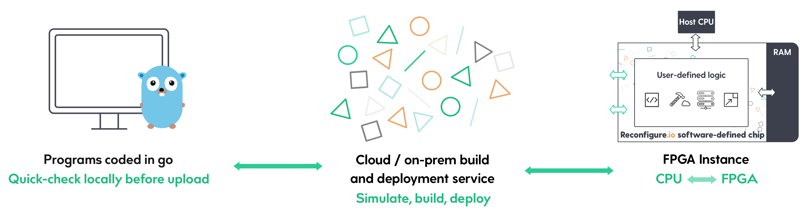
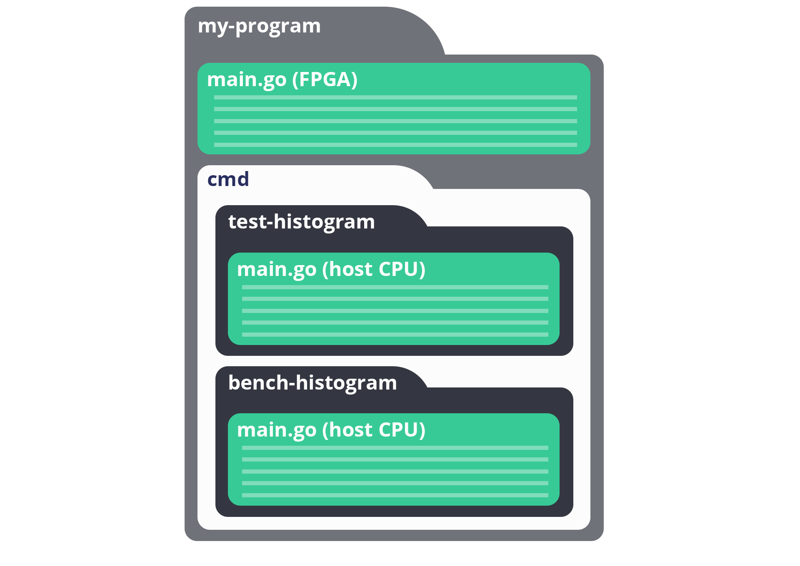
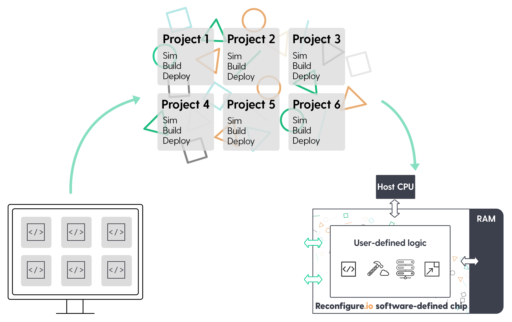
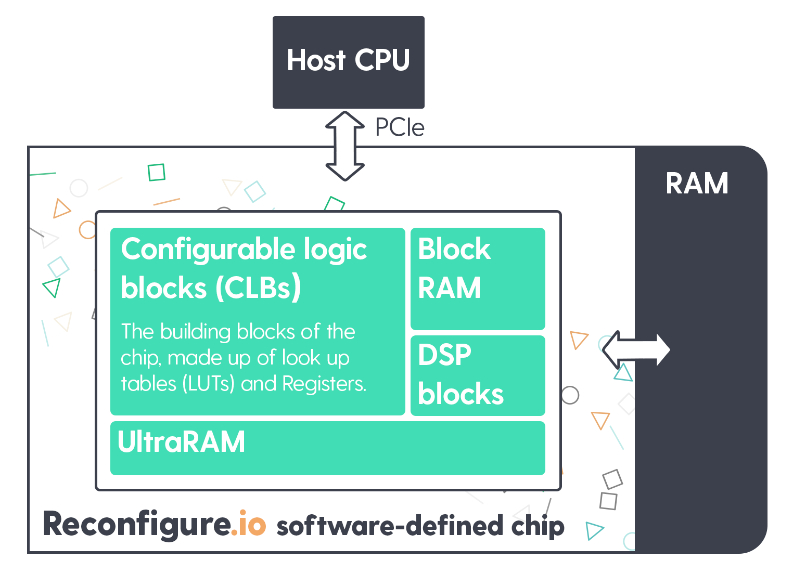

.. _overview:

How it works
=============================

.. admonition:: Our new compiler is in beta, and you can try it out now!

    To use the beta version of our new compiler, simply add the line ``compiler: rio`` to your project's ``reco.yml`` file. To read more about why and how the compiler is changing, check out our |blog|. Remember to let us know if you encounter any bugs or issues |bugs|.

This section gives an overview of the Reconfigure.io service. We'll start by running through our workflow and tooling, and then take a look at our system architecture and the steps we go through to get your code into a suitable format for programming an FPGA instance.

If you prefer to just get stuck in, you can jump straight to our :ref:`tutorials <demo>`, or watch a video run-through |video|.

Reconfigure.io is a platform as a service (PaaS), which takes Go code, compiles and optimizes it, and deploys to FPGA instances. Depending on which platform you're using, FPGA instances are either cloud-based (AWS F1) or on-premises. Either way, you will code in Go and interact with our service using ``reco``, our simple command-line tool.

Workflow and tooling
--------------------

The ``reco`` tool
^^^^^^^^^^^^^^^^^
Access to the Reconfigure.io service is through our tool – ``reco``. Use ``reco`` to check, upload and simulate your code, manage builds and deploy to an FPGA instance. You will be guided to install ``reco`` when you |sign up| but if you need guidance on updating and installing head :ref:`here <install>`.

``reco`` is a simple tool with several intuitive commands, we'll look at some of these in the relevant sections below – commands are described in bullet points. For a full list see, :ref:`tool`.

Let's take a look at the workflow from coding to deployment:

.. _code:

Code
^^^^^
All the code you write will be in Go. You can create projects in your Go workspace and edit with your favourite editor. A Reconfigure.io project is made up of at least two Go programs, one for the FPGA, and at least one for the host CPU, shown below within the ``cmd`` directory (you may have multiple host side commands for benchmarking etc.). We use a :ref:`subset of the Go language <gosupport>` for FPGA-side code and any new additions to the scope will be flagged up in our :ref:`Release_Notes`. Host-side code is written in standard Go.

.. code-block:: shell

    ├── cmd
    │   └── test-my-project
    │       └── main.go
    ├── main.go
    ├── reco.yml

You will use our |sdaccel| for both FPGA and host-side code. We provide a subpackage within that called ``XCL`` to allow the host to talk to the FPGA card, and subpackage called ``SMI`` for the FPGA to talk to the shared memory situated on the FPGA card.

The |smi_blog| protocol is our standard way of having the FPGA talk to shared memory (find more on this in our :ref:`third tutorial <structure>`), and is designed specifically for working with FPGAs, where the potential for fine-grained parallelism is high, with many, potentially thousands of go routines, trying to access memory at the same time.

Each project's ``reco.yml`` file contains some simple settings, here's an example for a project that requires two SMI ports (one read, and one write port) - Also included here is a line to choose to use our new compiler, Rio, which is currently in beta:

.. code-block:: shell
   :emphasize-lines: 4

    memory_interface: smi
    memory_width: 512
    ports: 2
    compiler: rio

.. note::
   When using Rio, loop unrolling is now automatic so you don't need to do this in your code. Loop unrolling is done within the new compiler on a cost basis – more complex loops, and those with more iterations are less likely to be unrolled. Also pipelining is no longer automatic but can be achieved using goroutines.

Go tooling
^^^^^^^^^^^
Your Reconfigure.io projects are developed in your Go environment so you can use standard Go tooling throughout the process: ``go build`` and ``go test`` can be used to flag up any semantic or syntactic errors and run tests against your FPGA code. You can read more about the Go testing framework |go_test|. You can also |benchmark| your designs using the Go testing framework, the benchmark is written into your program and then run during deployment to get an accurate measurement from the process running on hardware.

.. code-block:: shell

    ├── cmd
    │   └── test-my-project
    │       └── main.go
    │   └── bench-my-project
    │       └── main.go
    ├── main.go
    ├── main_test.go

Check
^^^^^
Once you are happy with your code you can perform a quick-check to make sure it is compatible with our compiler. If your code contains any errors, or you've used elements of Go that are out of scope for FPGA-side code, these will be flagged up during this check.

* ``reco check`` locally type checks your FPGA code.

Simulate
^^^^^^^^^
Next, you can simulate how your program will run on hardware. Any errors will be highlighted here and it is considerably quicker than creating a build – minutes rather than hours – so will save you time during the development process. Simulations will :ref:`timeout <timeout>` if they don't complete within one hour.

*  ``reco sim run <my_cmd>`` simulates how your program would run on an FPGA.

.. _graph:

Graph
^^^^^
Our compiler takes your Go code through several stages to get it into a suitable format for programming an FPGA instance. First, your code is translated into a language called Teak, then, using the Teak output we can generate dataflow graphs. Using the ``graph`` command you can generate a dataflow graph for your program at any time, allowing you to analyze and optimize its performance.

.. note::
    The ability to generate graphs is a temporary feature. Due to the complexity of the output we suggest you share your graphs with us on our |forum| so our engineers can assist you in optimizing your code.

*  ``reco graph gen`` generates a dataflow graph from the program in your current directory.
*  ``reco graph list`` lists all graphs in your project along with their unique IDs.
*  ``reco graph open <graph_ID>`` lets you view any graph in your default default PDF viewer.

Build
^^^^^^^^
Next, you can build your project. Our compiler will check compatibility and convert your code into an image suitable for deploying to an FPGA instance. Builds will :ref:`timeout <timeout>` if they don't complete within 12 hours.

.. admonition:: Build Times

   Build times are currently in the region of 4 hours. This is longer than we would like and is partly due to underlying silicon vender tools, which we are currently working to address. Although the build time is relatively long, it is not something you will have to do very often during your program development - you will mostly use our hardware simulator, which takes minutes rather than hours.

* ``reco build run`` uploads the code from your current directory to the Reconfigure.io service. Building will automatically start once the upload has completed. Your Go code will be compiled and optimized to run on an FPGA instance. It's a good idea to add a message to your build, just as you would with a git commit, so you can remember what it's for later. To do this, use the ``-m`` or ``--message`` flag followed by your short message, like this: ``reco build run -m "my helpful message"``.
* ``reco build list`` lists all builds for the current project along with their statuses. Each build is date-stamped and given a unique ID, and you can see any messages you have included so you can always make sure you're using the correct build when working on large and complex projects.
* ``reco build report <build_ID>`` will bring up stats for how much of the FPGA's resources your design uses.

Deploy
^^^^^^
Once your build is complete you can deploy the image to an FPGA instance. This process programs the FPGA with your compiled and optimized code and runs your chosen host-side command on the CPU.

* ``reco deploy run <build_ID> <cmd>`` will deploy your build to the FPGA and run your chosen command on the host CPU.

.. admonition:: Attention cloud users!

    Live deployments are charged to your account (open-source users get 20 hours/month for free) and if you run out of allotted hours any live deployments you have running will be terminated. If your deployment is designed to run indefinitely as a service, it is important to remember to stop it: ``reco deployment stop <deployment-ID>`` to avoid running out of hours. It is good practice to include a timeout for services, in case you forget to stop them. To do this you can run ``reco deployment run <build-ID> timeout 30m <cmd>`` to ensure that the service is active for 30 minutes max. You can set whatever timeout you want, using hours ``1h``, minutes ``1m`` and seconds ``1s``.

.. _project-structure:

Structure
------------------

Programs
^^^^^^^^
Reconfigure.io **programs** have a simple structure: code for the FPGA and code for the host CPU, all written in Go:

You can have multiple host-side commands per program, and once your code is built each host command will be available to run with the FPGA-side code during deployment. For example, as indicated in the diagram above, you may have one host-side command that just feeds data to the FPGA, receives the output and relays is, and another host-side command that, as well as feeding and receiving data, runs a benchmark (using the Go benchmarking framework) to check the performance of the FPGA code.

Projects
^^^^^^^
When using ``reco`` to simulate, build and deploy your programs, you will work within a **project**. You can list items per project, which is really useful when you've got several work streams going at the same time, each with several builds and deployments.

.. note::

    You should create a new project for each program you work on. If you run a ``sim``, ``build`` or ``deploy`` without setting which project to use first, you will be prompted to run ``reco set-project <project name>`` before continuing. If it's a new program you are working on you will need to run ``reco create-project`` followed by a new project name.

* ``create-project`` is used to create a new project
* ``projects`` displays a list of all active projects for your account
* ``set-project`` sets a project to use for the program code you're currently working on - this only needs to be run once per program 

.. _architecture:

System architecture
--------------------
Our software defined chips are based on FPGA instances, each of which is made up of an FPGA, dedicated RAM (we call this shared memory) and a host CPU. For on-prem customers, other high performance IO will be available, 2x 10 gigabit ethernet is standard.

Data can be shared between the FPGA chip and host CPU via shared memory; the host can allocate blocks in shared memory and pass pointers to the FPGA, and the FPGA can read and write to and from those pointers. The FPGA also has on-chip block RAM, which it can allocate directly.

CPU vs FPGA
^^^^^^^^^^^^
The Go language is designed for writing concurrent programs, which you can read more about |why_go|. Go is normally used to write for traditional CPUs, where concurrent programming can take advantage of multi-core CPUs to perform several operations in parallel. But, when we optimize your Go for an FPGA, this potential for parallel processing is drastically increased.

For example, a goroutine running on a CPU is a tiny light-weight thread running within a bigger thread, with just one big thread per CPU core. There is potential for parallelism here, but only one operation can happen per core per unit of time. On an FPGA, one goroutine translates to a small chunk of circuitry, running continuously, so you *could* create a million of them, and they could all do their work, all the time.

Go compilation stages
^^^^^^^^^^^^^^^^^^^^^
Your Reconfigure.io applications will be coded using :ref:`our subset <gosupport>` of the standard Go language, and you can use our :ref:`coding style-guide <style>` to get the most out of the destination hardware.

We take your code through several stages to get it ready to program an FPGA:

* **Teak** – first, your Go is translated into |teak|, a data-flow language with its roots in research from the University of Manchester. This allows us (and you, using :ref:`graphs <graphs>`) to optimize your code for the FPGA architecture.
* **Verilog RTL representation** - this 'register transfer level' description is suitable for taking your code into the traditional FPGA development process.
* **Verilog netlist** - we then use standard tooling to compile your code into a netlist which relates to the FPGA's logic components.
* **Place and route** – this is where we decide where on the physical FPGA chip to place the components from the netlist.
* **Bitstream** - the last part of the process is using the place and route output to generate a bitstream capable of programming the FPGA.

.. |smi_blog| raw:: html

   <a href="https://medium.com/the-recon/introducing-smi-7a216e2dff45" target="_blank">SMI</a>

.. |examples| raw:: html

   <a href="https://github.com/ReconfigureIO/examples" target="_blank">examples</a>

.. |teak| raw:: html

   <a href="http://apt.cs.manchester.ac.uk/projects/teak/" target="_blank">Teak</a>

.. |why_go| raw:: html

   <a href="https://medium.com/the-recon/why-do-we-use-go-511b34c2aed" target="_blank">here</a>

.. |go_test| raw:: html

   <a href="https://golang.org/doc/code.html#Testing" target="_blank">here</a>

.. |video| raw:: html

   <a href="https://youtu.be/yIHToaGI4_M" target="_blank">here</a>

.. |benchmark| raw:: html

   <a href="https://medium.com/the-recon/benchmarking-go-code-running-on-fpgas-ce9d97a62917" target="_blank">benchmark</a>

.. |forum| raw:: html

   <a href="https://community.reconfigure.io/c/optimization-support" target="_blank">forum</a>

.. |sign up| raw:: html

   <a href="https://reconfigure.io/sign-up" target="_blank">sign up</a>

.. |blog| raw:: html

   <a href="https://medium.com/the-recon/reconfigure-io-move-to-llvm-for-major-performance-and-usability-improvements-1f9c36ca424" target="_blank">blog post</a>

.. |bugs| raw:: html

   <a href="https://community.reconfigure.io/c/report-a-bug" target="_blank">on our forum</a>

.. |sdaccel| raw:: html

   <a href="https://godoc.org/github.com/ReconfigureIO/sdaccel" target="_blank">Go-SDAccel package</a>
