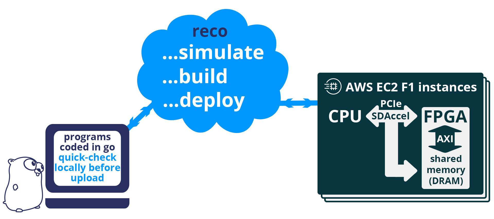
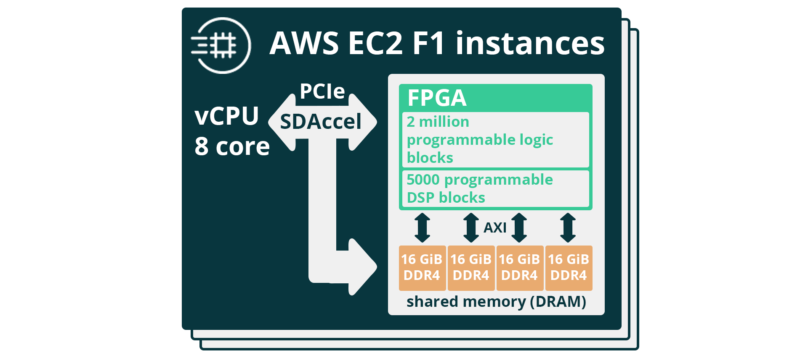
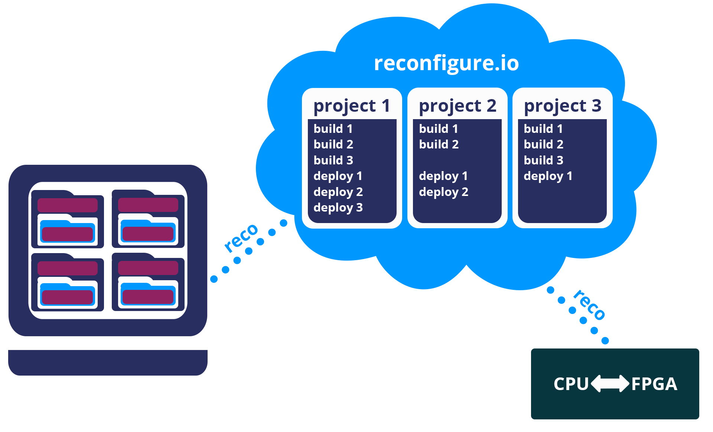

.. _overview:

How does it Work?
=============================
This section is an overview of our service, tooling and workflow. To take a more in-depth look at workflow you can jump to our tutorials, starting here: :ref:`demo`.

System architecture
--------------------
Reconfigure.io is a platform as a service (PaaS), which takes your Go code, compiles and optimizes it, and deploys to cloud-based FPGAs. You will code in Go and interact with the service using our simple command-line tool. We use AWS F1 instances for our cloud FPGAs, but all you need to use our service is a Reconfigure.io account and our command-line tool – we take care of the rest.

The image below describes how Reconfigure.io works. All coding is done locally in Go and you can develop and debug your projects in your Go environment before using our tools to simulate, build and deploy to FPGAs in the cloud. F1 instances include a host CPU with an FPGA connected via PCIe.

Each FPGA card has 64 GiB dedicated memory (DRAM) which can be used to share data between the CPU and FPGA. The host CPU can allocate blocks in shared memory and pass pointers to the FPGA, and the FPGA can read and write to and from those pointers. The FPGA also has on-chip block RAM, which it can allocate directly.

A note about memory access – AXI / SMI
----------------------------------------
Our current standard way of having the FPGA talk to shared memory is using the AXI protocol (find more on this in our :ref:`third tutorial <structure>`). AXI is designed to work with multicore CPUs, with several cores accessing memory at the same time. But for us, as we're using Go for FPGAs, the level of parallelism is so much higher. We're dealing with many, potentially thousands of go routines trying to access memory at the same time. Managing this with AXI is not straightforward.

**Our engineers have developed a new protocol – SMI (Scalable Multiprotocol Infrastructure) – which addresses the issue of fine-grained parallelism, as well as simplifying code and reducing boilerplate for our users.** It's available for testing from Reconfigure.io v0.17.0 onwards and will be fully rolled out as our standard method for accessing memory very soon.

For more information, please see our |smi_blog| and you can check out our |examples| – we've included a version of our histogram-array code that uses SMI rather than AXI. We've also included an SMI-ready version of our `template <https://github.com/ReconfigureIO/tutorials/tree/master/template-SMI>`_ so you can start playing around with your own applications.

You will notice that with SMI we have introduced a ``reco.yml`` file per program. This contains some simple settings: Infrastructure (SMI or AXI), the memory access bandwidth (max 512 bit, min 64 bit) and the number of ports you require for your application. So, for a program using SMI, with one read and one write port, the settings should appear like this:

.. code-block:: shell

    memory_interface: smi
    memory_width: 512
    ports: 2

Go compilation stages
^^^^^^^^^^^^^^^^^^^^^
Your Reconfigure.io projects will be coded using :ref:`our subset <gosupport>` of the standard Go language, using our :ref:`coding style-guide <style>` to help get the most out of the destination hardware.

We take your code through several stages to get it ready to program an FPGA:

* **Teak** – first, your Go is translated into |teak|, a data-flow language with its roots in research from the University of Manchester. This allows us (and you, using :ref:`graphs <graph>`) to optimize your code for the FPGA architecture.
* **Verilog RTL representation** - this 'register transfer level' description is suitable for taking your code into the traditional FPGA development process.
* **Verilog netlist** - we then use standard tooling to compile your code into a netlist which relates to the FPGA's logic components.
* **Place and route** – this is where we decide where on the physical FPGA chip to place the components from the netlist.
* **Bitstream** - the last part of the process is using the place and route output to generate a bitstream capable of programming the FPGA.

CPU vs FPGA
^^^^^^^^^^^^
The Go language is designed for writing concurrent programs, which you can read more about |why_go|. Go is normally used to write for traditional CPUs, where the concurrency in programs using goroutines, channels and select statements can take advantage of multi-core CPUs to perform several operations in parallel. But, when we optimize your Go for an FPGA, this potential for parallel processing is drastically increased.

For example, a goroutine running on a CPU is a tiny light-weight thread running within a bigger thread, with just one big thread per CPU core. There is potential for parallelism here, but only one operation can happen per core per unit of time. On an FPGA, one go routine translates to a small chunk of circuit, continuously running, so you could create a million of them and they can all do their work all the time.

Tooling and project structure
------------------------------

The ``reco`` tool
^^^^^^^^^^^^^^
All access to the Reconfigure.io service is through our tool – ``reco``. Use ``reco`` to upload and simulate your code, manage builds and deploy to a remote FPGA. If you need to install or update ``reco`` you can find instructions :ref:`here <install>`.

``reco`` is a simple tool with several intuitive commands, we'll look at some of these in the relevant sections below – commands are described in bullet points. For a full list see, :ref:`tool`.

Projects and program structure
^^^^^^^^^^^^^^^^^^^^^^^^^^^^^^^
Reconfigure.io **programs** have a simple structure: code for the FPGA and code for the host CPU. Both are written in Go:

.. image::  ProgramStructure.png

When using ``reco`` to simulate, build and deploy your programs, you will work within a **project**. You can list items per project, which is really useful when you've got several work streams going at the same time, each with several builds and deployments.

.. note::

    You should create a new project for each program you work on. If you run a ``sim``, ``build`` or ``deploy`` without setting which project to use first, you will be prompted to run ``reco set-project <project name>`` before continuing. If it's a new program you are working on you will need to run ``reco create-project`` followed by a new project name.

* ``create-project`` is used to create a new project
* ``projects`` displays a list of all active projects for your account
* ``set-project`` sets a project to use for the program code you're currently working on

Workflow
---------
Let's take a look at the workflow, from coding to deployment:

Code
^^^^^
All the code you write will be in Go. You can create Go files in your working directory, following our program structure, and edit with your chosen editor - If you follow our standard go :ref:`setup instructions <gotools>` you will have in-editor checks working too. We use a streamlined subset of the Go language which is constantly being added to – any new additions will be flagged up in our :ref:`Release_Notes`.

Go test
^^^^^^^
If you have followed our Go tooling :ref:`setup instructions <gotools>` you can use ``go test`` to run tests against your FPGA code and flag up any semantic or syntactic errors. You can read more about the Go testing framework |go test|. Your ``main_test.go`` files can just be stored in a program's top directory.

Check
^^^^^
Once you are happy with your code in **standard** Go, you can perform a local quick-check to make sure it's compatible with our compiler. If there are any parts of your code that don't work with the Reconfigure.io compiler they will be flagged up here, followed by ``Error: error(s) found while checking <filename.go>``. If everything is fine you will see no output.

* ``reco check`` locally type checks your FPGA code.

Simulate
^^^^^^^^^
It's a good idea to test your code using our hardware simulator. Any errors will be highlighted and it's considerably quicker than creating a build so will save you time during the development process. Simulations will :ref:`timeout <timeout>` if they don't complete within one hour.

*  ``reco sim run <my_cmd>`` simulates how your program would run on an FPGA.

.. _graph:

Graph
^^^^^
Our compiler takes your Go code through several stages to get it into a format suitable for flashing an FPGA. First, it's translated into a language called Teak, then, using the Teak output we can generate dataflow graphs. Using the ``graph`` command you can generate a dataflow graph for your program at any time, allowing you to analyze and optimize its performance.

.. note::
    The ability to generate graphs is a temporary feature. Due to the complexity of the output we suggest you share your graphs with us in the 'early access' section of our `forum <https://community.reconfigure.io/c/early-access-feedback/optimization-support>`_, where our engineers can assist you to optimize your code. We're looking forward to see how you get on!

*  ``reco graph gen`` generates a dataflow graph from the program in your current directory.
*  ``reco graph list`` lists all your graphs along with their unique IDs.
*  ``reco graph open <graph_ID>`` lets you view any graph in your default default PDF viewer.

Build
^^^^^^^^
When your program is complete and tested it needs to be built. Our compiler will check compatibility and convert it into an image suitable for deploying to an FPGA. Builds will :ref:`timeout <timeout>` if they don't complete within 12 hours.

.. admonition:: Build Times

   Build times are currently in the region of 4 hours. This is longer than we would like and is partly due to underlying silicon vender tools, which we are currently working to address. Although the build time is relatively long, it is not something you will have to do very often during your program development - you will mostly use our hardware simulator, which takes minutes rather than hours.

*  ``reco build run`` uploads the code from your current directory to the Reconfigure.io service. Building will automatically start once the upload has completed. Your Go code will be compiled and optimized to run on an FPGA.
*  ``reco build list`` lists all builds for the current project along with their statuses. Each build is date-stamped and given a unique ID so you can always make sure you're using the correct build when working on large and complex projects.

Deploy
^^^^^^
Once your build is complete you can deploy the image to an F1 instance. This programs the FPGA with your compiled and optimized code and runs your chosen command on the host CPU.

*  ``reco deploy run <build_ID> <cmd>`` will deploy your build to the FPGA and run your chosen command on the host CPU.
* If your deployment is designed to run indefinitely, it is important to remember to stop it – live deployments are charged to your account (open-source users get 20 hours/month for free). Run ``reco deployment stop <deployment-ID>`` to stop a deployment. It is also good practice to include a timeout, just in case you forget to stop a deployment. To do this you can run ``reco deployment run <build-ID> timeout 30m <cmd>`` to ensure that the deployment runs for 30 minutes max. You can set whatever timeout you want, using hours ``1h``, minutes ``1m`` and seconds ``1s``.

.. |smi_blog| raw:: html

   <a href="https://medium.com/the-recon/introducing-smi-7a216e2dff45" target="_blank">blog post</a>

.. |examples| raw:: html

   <a href="https://github.com/ReconfigureIO/examples" target="_blank">examples</a>

.. |teak| raw:: html

   <a href="http://apt.cs.manchester.ac.uk/projects/teak/" target="_blank">Teak</a>

.. |why_go| raw:: html

   <a href="https://medium.com/the-recon/why-do-we-use-go-511b34c2aed" target="_blank">here</a>

.. |go_test| raw:: html

   <a href="https://golang.org/doc/code.html#Testing" target="_blank">here</a>
