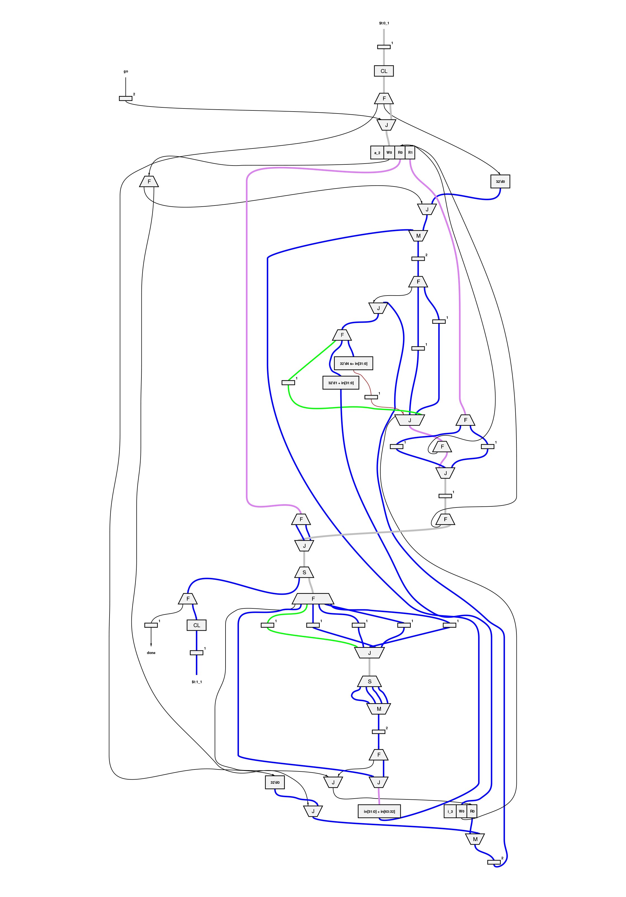
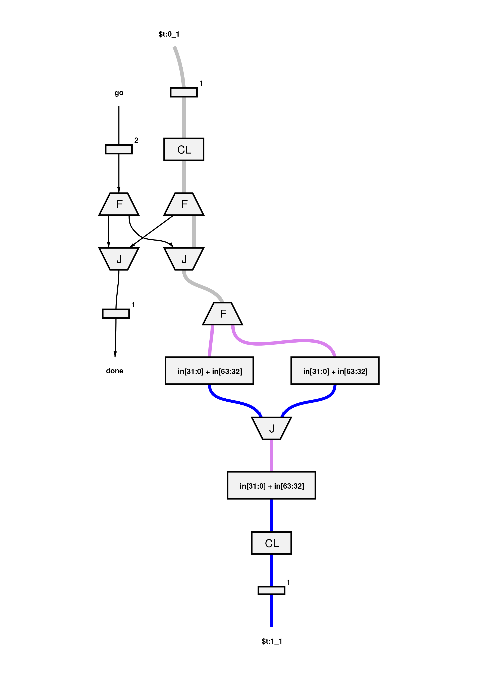
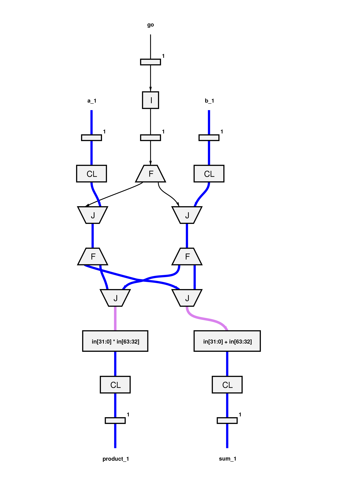

.. _style:

Coding Style Guide
==================

This style guide sets out some best practices for writing programs to be used with Reconfigure.io.

Template
--------
We provide a stripped down version of our project code to help you get started creating your own projects. You can find the template included in the examples you downloaded during our :ref:`first tutorial <examples>`. They're located here: ``examples/template``. For more information on using the template, see :ref:`structure`.

FPGA interface
-------------------
Our FPGA interface documentation details the Go packages required to communicate between the host CPU and FPGA, and for using the shared memory available on the FPGA card. The term 'kernel' is used to refer to the code running on the FPGA:

* |FPGA|

.. _organization:

Code organization
-----------------

Splitting code between a CPU and FPGA usually involves a separation that is different to what you would expect when using just a CPU. A CPU is flexible and good at sequential things, whereas the FPGA is good for static things that lend themselves to parallelism. The best separation will depend on your application, but dividing based upon the relative strengths of CPUs and FPGAs is generally a great place to start. For instance, for data processing applications, a natural separation would be to do data preprocessing and postprocessing on the CPU, while having the FPGA do a calculation intensive loop.

The host CPU
------------

Data types
^^^^^^^^^^
We suggest you specify 32 bit data types in your host code to avoid issues when data is passed between the host and CPU. On the FPGA an unspecified primitive data type would be 32 bit but on the CPU it would be 64 bit.

The FPGA
-------

Break out small functions
^^^^^^^^^^^^^^^^^^^^^^^^^
When using graph generation to inspect performance, it's generally better to break out small functions. This allows you to better reason about their parallel aspects, and then embed them into a larger program. For example, if ``(a * b) + c`` is in an inner loop of your application, breaking it out into the below function will help you see its performance in isolation.

For example:

.. code-block:: Go
   :linenos:

   func MultiplyAndAdd(a uint, b uint, c uint) uint {
      return (a * b) + c
   }

Use goroutines for small scale parallelism
^^^^^^^^^^^^^^^^^^^^^^^^^^^^^^^^^^^^^^^^^^
The compiler performs dependency analysis, and will parallelize statements that don't have a strict dependency on each other. In some cases, it will enforce an unnecessary sequential dependency. When you find these using the graph generation, you can use goroutines and channels to force parallelism.

.. code-block:: Go
   :linenos:

   // If this for some reason sequentializes the calls to Foo & Bar
   func Baz(a int, b int) int {
      return Foo(a) + Bar(a)
   }

   // You can force it to run them in parallel using goroutines
   // Here's a rewritten version of the function to force
   // the functions to be evaluated in parallel
   func Baz(a int, b int) int {
      tmp1 := make(chan int)
      go func(){
        tmp1 <- Foo(a)
      }()

      tmp2 := make(chan int)
      go func(){
        tmp2 <- Bar(b)
      }()

      return (<-tmp1) + (<-tmp2)
   }

Unroll loops
^^^^^^^^^^^^
For small, often used inner loops, it's best to unroll them to ensure parallel processing. In the below example, the loop version will take an order of magnitude longer to run than the unrolled version. You can see from the graphs that the loop is a much more complex process than the unrolled version.

.. code-block:: Go

   func Add4Loop(a [4]int) int {
      sum := 0
      for i := 0; i < 4; i++ {
          sum += a[i]
      }
      return sum
   }

    Graph of Add4Loop function

.. code-block:: Go

   func Add4Unrolled(a [4]int) int {
      return (a[0] + a[1]) + (a[2] + a[3])
   }

    Graph of Add4Unrolled function

Pipelining
^^^^^^^^^^
In most cases goroutines that process data from an input channel and write the result to an output channel within an infinite loop will transform to a pipeline.

As an example, the code below would result in a pipeline that you could stream data through at one element per clock:

.. code-block:: Go

    func foo(a <-chan int, b <-chan int, sum chan<- int, product chan<- int) {
      for {
        operandA := <-a
        operandB := <-b
        product <- operandA * operandB
        sum <- operandA + operandB
      }
    }

Here's the dataflow graph for the code above so you can see the pipelining:

The main limitations for this feature are:

* The goroutine must not have any internal state.
* No control flow structures can be used within the loop.
* The input and output channels must have a length of at least ``1`` in order to avoid rendezvous synchronisation with the producers and consumers.

.. _datasize:

Data size considerations
^^^^^^^^^^^^^^^^^^^^^^^^
**When passing data to the FPGA** the *size* of the data determines where on the FPGA it will end up, which in turn affects how it will be accessed:

* Arrays of 512 bits or fewer will be stored in registers
* Arrays of 513 bits or more will be held in block RAM

Block RAM access is always sequential, whereas registers support parallel reads and writes for operations accessing different parts of the register.

**When using** ``switch`` **statements** we suggest using the smallest possible data type because this reduces the amount of logic required to evaluate the switch conditions.

.. |FPGA| raw:: html

   <a href="https://godoc.org/github.com/ReconfigureIO/sdaccel" target="_blank">FPGA interface docs</a>
