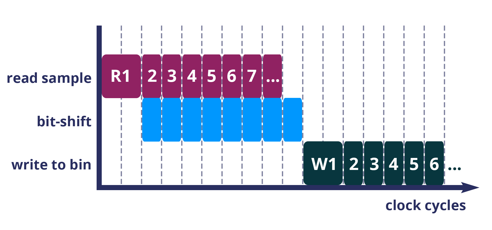

7 – The histogram example
--------------------------
Now let's look at how the histogram program was written and examine the code for both the host CPU and the FPGA.

To create a histogram we need to take some data samples and place each one into a bin – think of the bins as the histogram bars. Samples need to be placed into the correct bin, dependent on sample value and the ranges set for each bin. Bin ranges can be set in a convenient way so that huge numbers can be bit-shifted down and placed by just looking at their most significant bits – ``123`` rather than ``123,456``, for example.

Because the FPGA hardware is effectively a blank canvas, we have the option to perform many operations at the same time by configuring the FPGA into separate sections of circuitry for each of these processes that we want to run in parallel. This will massively speed up the throughput of our sample data. To take advantage of this we need to use Go's concurrency primitives to structure our code so it translates well onto the parallel hardware.

Introducing parallelism
-----------------------
Designing a concurrent program basically means writing some well structured code that breaks a problem down into processes that can be executed independently. Concurrent programs can work well on parallel hardware, such as an FPGA, because these independently executable processes, which are already contained and well structured, can be efficiently mapped to run in parallel.

If you code efficiently for multi-core CPUs, you are already writing concurrent programs — you will be familiar with making sure all processor cores are kept busy. A non-concurrent program running on a multi-core CPU could see one core doing all the work while the others are left idle.

There are several challenges that come with concurrent programming. Firstly, if left to their own devices, independent processes can run in any order leading to a lack of control over structure. For example, a process could attempt to perform an operation on some data that isn't available yet. Secondly, data needs to be passed between, and used by multiple processes at the same time. Go has several primitives that are specifically designed for writing concurrent programs, which help to overcome these design challenges:

* **Goroutines** allow you to run multiple functions at the same time within the same address space.
* **Channels** are directional constructs which allow you to introduce communication and synchronization by sending and receiving data to and from goroutines.
* **Select** statements allow you to control when concurrent operations can run by switching between channels. When we're thinking about a parallel system, select statements effectively give you control over when processes need to run sequentially, rather than concurrently, to meet your design requirements.

For a more in-depth look, see our |blog post| on why we use Go.

Parallelizing the histogram
----------------------------
We can use the histogram as an example of how a sequential design can be changed to take advantage of the parallel architecture provided by the FPGA. Histogram generation done sequentially, rather than in parallel, could work as follows:

  Sequential histogram flow diagram

And a pipeline diagram could look like this:

  Sequential histogram pipeline diagram

By far the slowest part of this design is reading from and writing to memory. So, to speed the whole thing up, we can parallelize the sample-handling section of the design, and take advantage of the AXI protocol's read/write bursts, which incur far less latency than memory reads and writes.

We can read the sample data from the shared memory using a read burst, then place it into a channel from where it can be sorted and placed into an array. The array data can then be easily loaded onto another channel and then written back to shared memory using a write burst. Here's a pipeline diagram for this scenario:

  Array histogram pipeline diagram

Quite a significant performance increase!

Next, let's look at a flow diagram for this parallelized histogram. You can see where the concurrent parts clearly on the FPGA side: the sample data is read and put into a channel, and at the same time the channel data is shifted and sorted into bins and held in an array. Then, the array data is placed into another channel, and at the same time this channel data is written to the shared memory so the host CPU can access it.

  Parallel histogram flow diagram

.. Let's take a closer look at how the channels are used to pass data between concurrent processes:

..  .. todo::
     Create a diagram to show channels used to share data

Now, let's take a look at the code...
-------------------------------------
If you look at the example code, you'll see there are two main.go files in there:

* ``examples/histogram-array/main.go`` is the code for the FPGA
* ``examples/histogram-array/cmd/main.go`` is for the host CPU

The CPU and FPGA work together to carry out the required tasks.

In this example, the host code allocates a block of memory, fills it with samples, then tells the FPGA where the samples are and where to put the results once it's finished its work.

**First, open** ``examples/histogram-array/cmd/test-histogram/main.go`` **in an editor and we'll look at the key sections.**

The first job for the host is to define the sample data that will be sent to the FPGA for generating the histogram. In this example, an array of 20 unsigned 32 bit integers (uint32) is used, then the length of this sample data is calculated in bytes and a space in shared memory (DRAM on the same card as the FPGA) is allocated to store it::

 // Define a new array for the data we'll send to the FPGA for processing
 input := make([]uint32, 20)

 // Seed it with 20 random values, bound to 0 - 2**16
 for i, _ := range input {
   input[i] = uint32(uint16(rand.Uint32()))
 }

 // Allocate a space in the shared memory to store the data you're sending to the FPGA
 buff := world.Malloc(xcl.ReadOnly, uint(binary.Size(input)))
 defer buff.Free()

Next, some space is defined for the response from the FPGA::

 // Construct an array to hold the output data from the FPGA
 var output [HISTOGRAM_WIDTH]uint32

 // Allocate a space in the shared memory to store the output data from the FPGA
 outputBuff := world.Malloc(xcl.ReadWrite, uint(binary.Size(output)))
 defer outputBuff.Free()

The sample data is then written to the allocated space in shared memory::

 // Write our input data to shared memory at the address we previously allocated
 binary.Write(buff.Writer(), binary.LittleEndian, &input)

In this next section the CPU communicates with the FPGA, passing input and output memory pointers and an indication of how many inputs to expect::

 // Pass the pointer to the input data in shared memory as the first argument
 krnl.SetMemoryArg(0, buff)
 // Pass the pointer to the memory location reserved for the result as the second argument
 krnl.SetMemoryArg(1, outputBuff)
 // Pass the total length of the input as the third argument
 krnl.SetArg(2, uint32(len(input)))

Next, we start the FPGA running::

 // Run the FPGA with the supplied arguments. This is the same for all projects.
 // The arguments ``(1, 1, 1)`` relate to x, y, z co-ordinates and correspond to our current
 // underlying technology.
 krnl.Run(1, 1, 1)

**So now the data has been shared, let's leave the host code for now and have a look at the FPGA code** ``examples/histogram-array/main.go`` **:**

First, some local variables are set up to take the input and output buffers and expected input length, which were sent over from the host::

   // Three operands from the host. Pointers to the input data and the space for the result in shared
   // memory and the length of the input data so the FPGA knows what to expect.
   inputData uintptr,
   outputData uintptr,
   length uint32,

Next, we set up ports for data IO between the FPGA and shared memory. For this example we need one read port so the FPGA can read the sample data in from shared memory, and one write port so the FPGA can transfer it's results to shared memory. This is done using our |smi| protocol::

   // Set up ports for interacting with the shared memory
    readReq chan<- smi.Flit64,
  	readResp <-chan smi.Flit64,

  	writeReq chan<- smi.Flit64,
  	writeResp <-chan smi.Flit64){

An array is then declared to hold the histogram data as it is sorted::

 // Create an array to hold the histogram data as it is sorted
 var histogram [512]uint32

Next, the sample data is read from shared memory and put into a channel. In parallel with this, the data is sorted, one sample at a time – each sample is bit-shifted down and the relevant bin in the array is incremented. You will notice the read burst is in a goroutine so it can happen concurrently with the ``for`` loop below::

    // Read all of the input data into a channel
     inputChan := make(chan uint32)
     go smi.ReadBurstUInt32(readReq, readResp, inputData, smi.DefaultOptions, length, inputChan)

     // The host needs to provide the length we should read
     for ; length > 0; length-- {
       // First we'll pull of each sample from the channel
       sample := <-inputChan

       // And increment the value in the correct bin using the calculation function
       histogram[CalculateIndex(sample)] += 1
     }

You will notice the function ``CalculateIndex`` is called to calculate the correct bin, the code for this is above the ``Top`` function::

   // function to calculate the bin for each sample
   func CalculateIndex(sample uint32) uint16 {
     return uint16(sample) >> (16 - 9)
   }

Now the histogram array is complete, the data is put into a channel so it can be written back to shared memory for the host CPU to access. Again, a goroutine is used to send the data to the output channel so it can happen concurrently with the data being taken from the channel and written to shared memory ::

    // Write the results to a new channel
     data := make(chan uint32)
     go func() {
       for i := 0; i < 512; i++ {
         data <- histogram[i]
       }
     }()

     // Write the results to shared memory
     smi.WriteBurstUInt32(
       writeReq, writeResp, outputData, smi.DefaultOptions, 512, data)

**Now we're back to the host code** to bring the data back from the FPGA::

    // Read the result from shared memory. If it is zero return an error
     err := binary.Read(outputBuff.Reader(), binary.LittleEndian, &output)
     if err != nil {
       log.Fatal("binary.Read failed:", err)
    }

Next, a test is run to check that the returned data matches what is expected before the histogram data is printed so you can see the results::

    // Calculate the same values locally to check the FPGA got it right
    var expected [HISTOGRAM_WIDTH]uint32
    for _, val := range input {
     expected[val>>(MAX_BIT_WIDTH-HISTOGRAM_BIT_WIDTH)] += 1
    }

    // Return an error if the local and FPGA calculations do not give the same result
    if !reflect.DeepEqual(expected, output) {
     log.Fatalf("%v != %v\n", output, expected)
    }

    log.Println()
    log.Printf("We programmed the FPGA to sort 20 integers into bins, and these are the results we got: \n")

    // Print out each bin and coresponding value
    for i, val := range output {
    	fmt.Printf("%d: %d\n", i<<(MAX_BIT_WIDTH-HISTOGRAM_BIT_WIDTH), val)
    }

What's next
-----------------------------
So, we've deployed some code to an FPGA, stepped through our workflow and code and looked at introducing some concurrency into programs. Move on to :ref:`tutorial 2 <addition>` where we'll guide you through completing some code for a simple program.

.. |blog post| raw:: html

   <a href="https://medium.com/the-recon/why-do-we-use-go-511b34c2aed" target="_blank">blog post</a>

.. |smi| raw:: html

    <a href="https://godoc.org/github.com/ReconfigureIO/sdaccel/smi" target="_blank">SMI</a>
