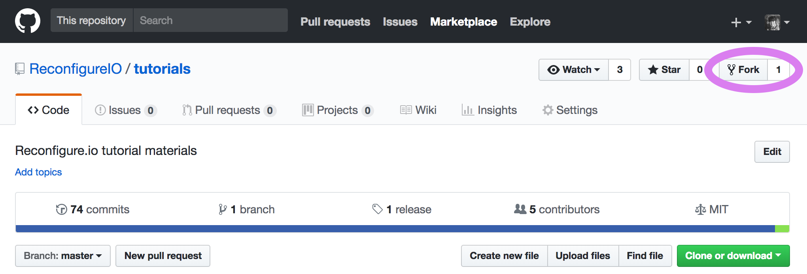

.. _fork:

2 – Fork our tutorials repository
---------------------------------
We're going to start using our tutorial materials repo, which contains an incomplete example for you to work on. So, as we're going to be making changes to the code, let's fork the repo. You'll find it |tutorials|.

First, click the **fork** button towards the top right of the screen.

You will be asked to authorize the fork being placed into your account. Then, using the instructions for your operating system below, clone your fork to your local machine:

Linux/MacOSX
^^^^^^^^^^^^
From a terminal create an environment variable for your github username (substitute ``<username>`` for your github username):

.. code-block:: shell

    export GITHUB_USERNAME=<username>

Then copy and paste the following:

.. subst-code-block:: shell

    git clone https://github.com/$GITHUB_USERNAME/tutorials.git $GOPATH/src/github.com/$GITHUB_USERNAME/tutorials
    cd $GOPATH/src/github.com/$GITHUB_USERNAME/tutorials
    git remote add upstream git://github.com/ReconfigureIO/tutorials.git
    git fetch upstream
    git checkout |tutorials_version|

Windows 10
^^^^^^^^^^
From a Powershell terminal create an environment variable for your github username (substitute ``<username>`` for your github username):

.. code-block:: shell

    $env:GithubUsername="<username>"

Then copy and paste the following:

.. code-block:: shell

    git clone https://github.com/$env:GithubUsername/tutorials.git $Env:GOPATH/src/github.com/$env:GithubUsername/tutorials
    cd $Env:GOPATH/src/github.com/$env:GithubUsername/tutorials
    git remote add upstream git://github.com/ReconfigureIO/tutorials.git
    git fetch upstream
    git checkout v0.1.0

.. |tutorials| raw:: html

   <a href="https://github.com/ReconfigureIO/tutorials" target="_blank">here</a>
