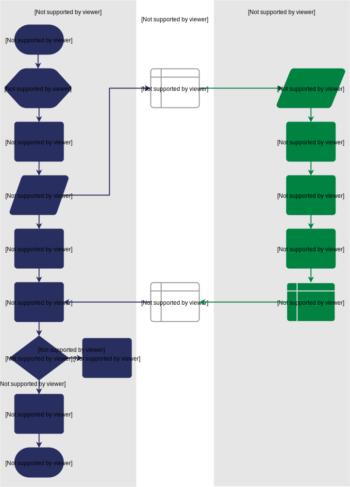

What's the problem?
-------------------
We want the FPGA to take two integers, 1 and 2, add them together and send the result back to us. As you saw in our first example, we're programming an FPGA instance, which is made up of an FPGA card, which includes some shared memory, connected to a host CPU. So, the first thing we need to do is decide what works the FPGA and the host need to do. Then, we can write some Go code to tell the host CPU how to communicate with the FPGA, as well as some Go code to program the FPGA to carry out the required tasks.

Let's break this process down. There are just two operands involved, so the host can pass them straight to the FPGA along with an address at which to store the result. Then, the FPGA can add the operands together and write the result back to the specified address. The host can read the result and print it for us to see. A flow diagram could look like this:

   Addition flow diagram

.. _tutorials:
