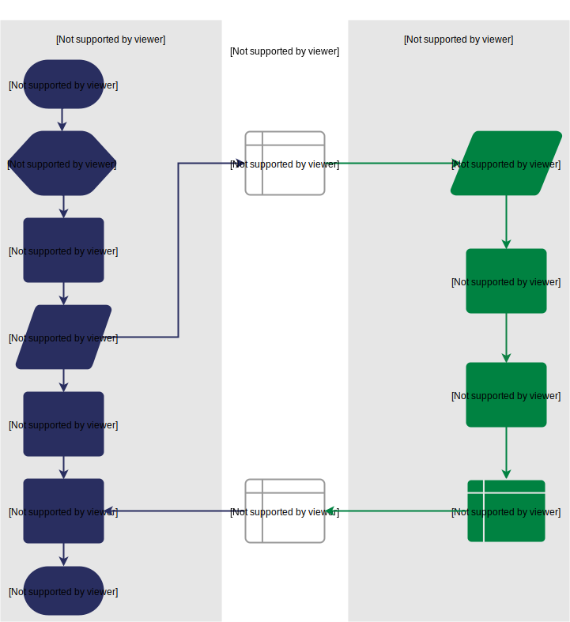

5 – A simple multiplication example
------------------------------------
To explore these methods of passing data around, let's use our template to write a very simple program to pass one integer to the FPGA from the host and tell the FPGA to multiply this integer by 2 and pass it back to the host. **As we're passing a single integer, the host can pass this straight to the FPGA's control register but the route back from the FPGA to the CPU is always via the shared memory**. As we have done in previous tutorials, lets first look at a flow diagram for this example:

We can use our template to write the code to perform this multiplication. 
