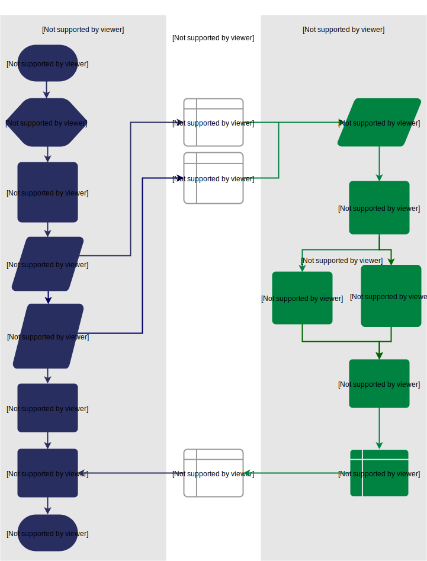

10 – An example with more data
-----------------------------
In that last example, as we only needed to pass a single argument from host to FPGA, we sent it straight to the FPGA's control register. This time, we're going to pass an array, so we'll send it via shared memory.

You can use the code you created above as the basis for this new example and just make the changes required to pass more data. So, duplicate the ``multiply1`` directory and rename it to ``multiply-array``::

  cp -r multiply1 multiply-array
  cd multiply-array/cmd
  mv test test-multiply-array

You should have something like this::

  multiply-array
  ├── README.md
  ├── cmd
  │   └── test-multiply-array
  │       └── main.go
  ├── glide.yaml
  ├── main.go
  ├── main_test.go
  ├── reco.yml
  └── vendor
    └── ...
