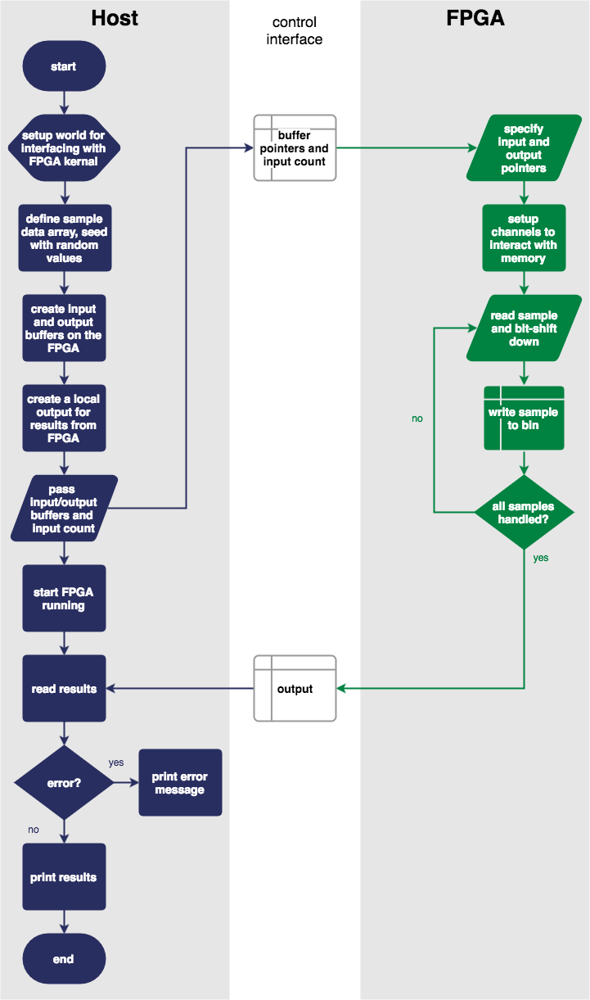
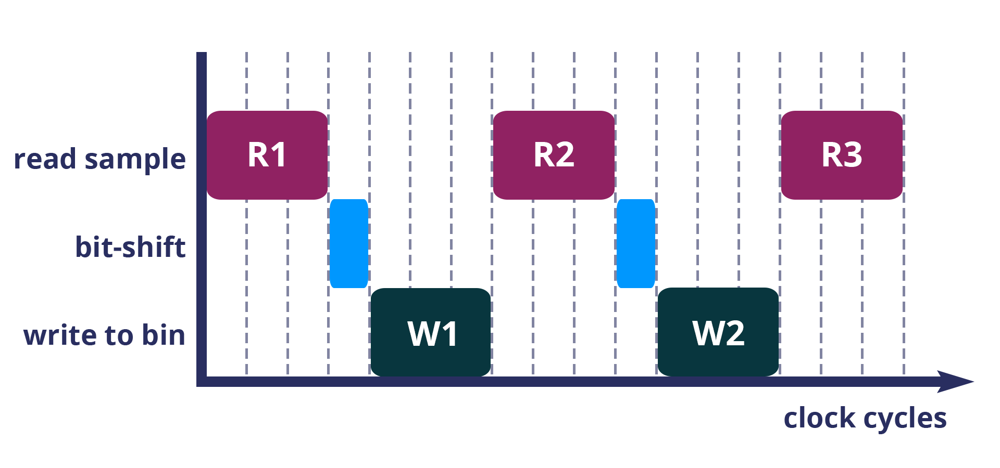
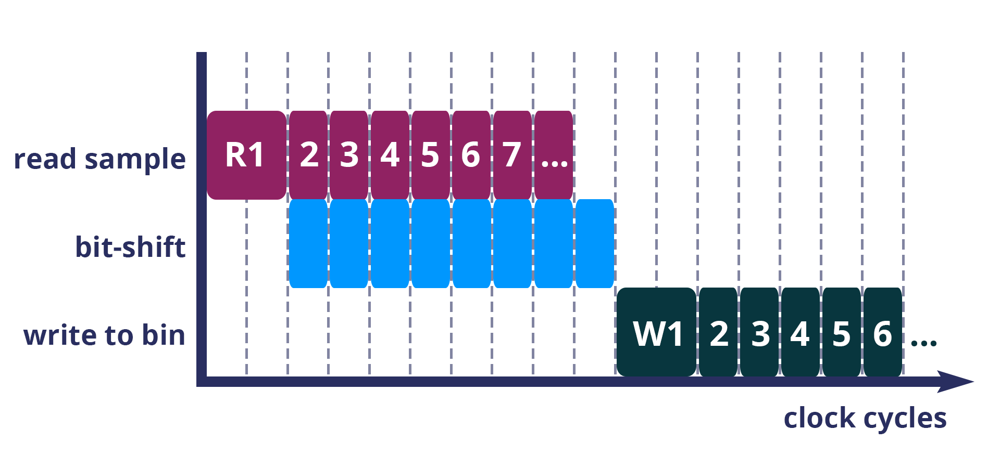
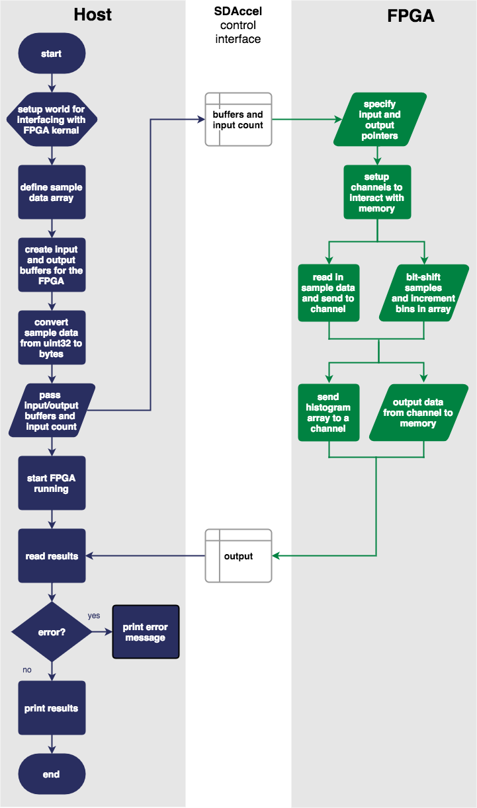

.. _demo:

Tutorial 1 – Setup and workflow
===============================================
.. sidebar:: Keeping up-to-date...

    Run ``reco update`` to check which version of our command line tool you have installed. Current version: |reco_version|.

This tutorial is a simple introduction to the Reconfigure.io workflow. We will use our parallelized histogram example, in which a block of memory is filled with sample data before an FPGA is put to work classifying the samples into bins. The contents of each bin is then read out, providing the data required to draw a histogram. **It's all pretty straightforward so in a few minutes you will have done a hardware simulation of a project running on an FPGA, and then deployed a build image of that project to an FPGA in the cloud.** If you would rather watch a video runthrough of the main points in this tutorial, you can do so |video|.

What we will do
----------------
* Check your Go environment is all set up
* Clone our examples repo
* Test our histogram example using ``go test``
* Run through our tooling workflow using ``reco`` to check, simulate and deploy a build image to a cloud FPGA
* Step through the code to see how it is structured

From here, we're assuming you've already set up your account and :ref:`installed and authenticated <install>` ``reco`` – if you don't have an account yet, please visit our `website <https://reconfigure.io/sign-up>`_.

.. _examples:

Clone our examples repository
----------------------------
First we need some code to work with. If you already use Go, and have your ``GOPATH``, workspace and tooling set up, and have |git| set up on your local machine, you can now clone our examples repo into your workspace by following the instructions for your operating system below.

If you are new to Go, please follow our :ref:`quick setup guide <gotools>` first.

.. _examples-linux:

Linux/MacOSX
^^^^^^^^^^^^
From a terminal copy and paste the following:

.. subst-code-block:: shell

    git clone https://github.com/Reconfigureio/examples.git $GOPATH/src/github.com/Reconfigureio/examples
    cd $GOPATH/src/github.com/Reconfigureio/examples
    git checkout |examples_version|

.. _examples-win:

Windows 10
^^^^^^^^^^
From a Powershell terminal copy and paste the following:

.. subst-code-block:: shell

    git clone https://github.com/Reconfigureio/examples.git $Env:GOPATH/src/github.com/Reconfigureio/examples
    cd $Env:GOPATH/src/github.com/Reconfigureio/examples
    git checkout |examples_version|

.. _test:

Run a test
----------
Now we've got everything set up and in the right place, we can check it's all working by running a test on the histogram-array code using ``go test``.

If you look inside ``examples/histogram-array`` you'll see several elements: the two main.go files that make up the program, a test ``main_test.go`` for checking that the program operates correctly and a vendor folder containing our package for interacting with SDAccel using Go (The contents of the vendor folder aren't displayed in this tree diagram because there's a lot in there and we don't need to look at it now).

.. code-block:: shell

    .
    ├── README.md
    ├── cmd
    │   └── test-histogram
    │       └── main.go
    ├── main.go
    ├── main_test.go
    └── vendor
      └── ...

For this example, ``main_test.go`` checks that the FPGA will not calculate an invalid bin when sorting data samples. Run ``go test`` now and you should see:

.. code-block:: shell

    $ go test
    PASS
    ok      /github.com/ReconfigureIO/examples/histogram-array    0.005s

This shows us that your Go environment is set up correctly and the code passes the conditions set in ``main_test.go``.

Check for compatibility
-------------------------------------------
Now you can type-check the FPGA code using our command line tool ``reco``. This tells us whether the code is compatible with the Reconfigure.io compiler and will point out any syntactic errors. To do this run ``reco check`` and you should see:

.. code-block:: shell

   $ reco check
   /github.com/ReconfigureIO/examples/histogram-array/main.go checked successfully

Simulate
--------
Our tooling requires that you work within a project, so, before we start anything else, let's define a project – call it ``histogram``, and set that project to be active::

  reco project create histogram
  reco project set histogram

You can now simulate the program using the ``reco sim`` command. This is a really useful stage in our workflow as it allows you to see how the program will run on the FPGA before the more time-intensive build stage.

.. admonition:: Getting in the queue

    Simulation should normally only take around 5 minutes but could be up to 30 minutes depending on what else is in the queue.

Run ``reco sim run test-histogram`` and you should see:

.. code-block:: shell

    $ reco test run test-histogram
    preparing simulation
    done
    archiving
    done
    uploading
    done
    running simulation
    status: QUEUED
    Waiting for Batch job to start
    status: STARTED
    ...
    INFO: [XOCC 60-629] Linking for hardware emulation target
    INFO: [XOCC 60-895]    Target platform: /opt/Xilinx/SDx/2017.1.op/platforms/xilinx_aws-vu9p-f1_4ddr-xpr-2pr_4_0/xilinx_aws-vu9p-f1_4ddr-xpr-2pr_4_0.xpfm
    INFO: [XOCC 60-423]   Target device: xilinx:aws-vu9p-f1:4ddr-xpr-2pr:4.0
    INFO: [XOCC 60-251]   Hardware accelerator integration...
    INFO: [XOCC 60-244] Generating system estimate report...
    INFO: [XOCC 60-677] Generated system_estimate.xtxt
    INFO: [XOCC 60-586] Created /mnt/.reco-work/sdaccel/dist/xclbin/kernel_test.hw_emu.xilinx_aws-vu9p-f1_4ddr-xpr-2pr_4_0.xclbin
    INFO: [XOCC 60-791] Total elapsed time: 0h 1m 54s
    INFO: [SDx-EM 01] Hardware emulation runs detailed simulation underneath. It may take long time for large data set. Please use a small dataset for faster execution. You can still get performance trend for your kernel with smaller dataset.
    ...
    0: 0
    128: 0
    256: 0
    384: 0
    512: 0
    640: 0
    768: 0
    896: 0
    1024: 1
    ...
    64256: 0
    64384: 0
    64512: 0
    64640: 0
    64768: 0
    64896: 0
    65024: 0
    65152: 1
    65280: 1
    57216: 0

Build
------------------
After running a successful simulation, the next step is to build the program. Running a build takes the program code and creates an image suitable for programming the FPGA/host instance. Our build process currently takes in the region of 4 hours. This is longer than we would like and is partly due to underlying silicon vender tools, which we are currently working to address. For this reason, we're not going to start a build now - we don't want you to have to wait that long to move on! So, we have a pre-built image ready for you to deploy in the next section.

As we're running though the workflow, it's still worth looking at how we would run a build, so here goes: running ``reco build run`` will take the program code in your current location and compile, optimize and translate it into a deployable image:

.. code-block:: shell

     $ reco build run
     INFO: [XOCC 60-629] Linking for hardware target
     INFO: [XOCC 60-423]   Target device: xilinx:adm-pcie-ku3:2ddr-xpr:3.2
     INFO: [XOCC 60-251]   Hardware accelerator integration...
     INFO: [XOCC 60-244] Generating system estimate report...
     INFO: [XOCC 60-677] Generated system_estimate.xtxt
     INFO: [XOCC 60-586] Created /data/job/<build_ID>/.reco-work/sdaccel/dist/xclbin/kernel_test.hw.xilinx_adm-pcie-ku3_2ddr-xpr_3_2.xclbin

     <build_ID>

The build ID referenced above will be a long string of characters, unique to each build. You will use the build ID to deploy the image, and you can inspect a list of your builds by running ``reco build list``:

.. code-block:: shell

   $ reco build list
   id                                      started                 status
   5434e2c1-cafc-44ca-ab2d-969a2f33895d    2016-12-08T21:08:00Z    PROCESS STARTING
   0b15ec5c-f3ba-11e6-9f75-127f5e3af928    2016-12-08T17:01:00Z    COMPLETED
   cdb339dd-8fb5-457c-9439-3f40267678e8    2016-12-08T18:31:58Z    COMPLETED WITH ERROR

.. note::
   When you come to work on your own projects, you might create many different builds for the same code. The build list's date-stamping and status reports help to identify the build you want to run.

Deploy an image
-----------------
Let's deploy our pre-built image for this example. Running a deployment will program the FPGA with the compiled and optimized Go and deploy the host Go to the host CPU. Please copy and paste the following command and run it in a terminal:

.. subst-code-block::

    reco deploy run 31b835ac-5575-4ebc-b8c8-0007d629bd8f test-histogram

Once the deployment is complete you should see the histogram readout:

.. code-block:: shell

     0: 0
     128: 0
     256: 0
     384: 0
     512: 0
     640: 0
     768: 0
     896: 0
     1024: 1
     ...
     64256: 0
     64384: 0
     64512: 0
     64640: 0
     64768: 0
     64896: 0
     65024: 0
     65152: 1
     65280: 1
     57216: 0

The histogram example
---------------------
Now let's look at how the histogram program was written and examine the code for both the host CPU and the FPGA.

To create a histogram we need to take some data samples and place each one into a bin – think of the bins as the histogram bars. Samples need to be placed into the correct bin, dependent on sample value and the ranges set for each bin. Bin ranges can be set in a convenient way so that huge numbers can be bit-shifted down and placed by just looking at their most significant bits – ``123`` rather than ``123,456``, for example.

Because the FPGA hardware is inherently parallel, we have the option to perform many operations at the same time, massively speeding the process up. To take advantage of this we need to use Go's concurrency primitives to structure our code so it translates well onto the parallel hardware.

Introducing parallelism
-----------------------
Designing a concurrent program basically means writing some well structured code that breaks a problem down into processes that can be executed independently. Concurrent programs can work well on parallel hardware, such as an FPGA, because these independently executable processes, which are already contained and well structured, can be efficiently mapped to run in parallel.

If you code efficiently for multi-core CPUs, you are already writing concurrent programs — you will be familiar with making sure all processor cores are kept busy. A non-concurrent program running on a multi-core CPU could see one core doing all the work while the others are left idle.

There are several challenges that come with concurrent programming. Firstly, if left to their own devices, independent processes can run in any order leading to a lack of control over structure. For example, a process could attempt to perform an operation on some data that isn't available yet. Secondly, data needs to be passed between, and used by multiple processes at the same time. Go has several primitives that are specifically designed for writing concurrent programs, which help to overcome these design challenges:

* **Goroutines** allow you to run multiple functions at the same time within the same address space.
* **Channels** are directional constructs which allow you to introduce communication and synchronization by sending and receiving data to and from goroutines.
* **Select** statements allow you to control when concurrent operations can run by switching between channels. When we're thinking about a parallel system, select statements effectively give you control over when processes need to run sequentially, rather than concurrently, to meet your design requirements.

For a more in-depth look, see :ref:`concurrency`.

Parallelizing the histogram
----------------------------
We can use the histogram as an example of how a sequential design can be changed to take advantage of the parallel architecture provided by the FPGA. Histogram generation done sequentially, rather than in parallel, could work as follows:

  Sequential histogram flow diagram

And a pipeline diagram could look like this:

  Sequential histogram pipeline diagram

By far the slowest part of this design is reading from and writing to memory. So, to speed the whole thing up, we can parallelize the sample-handling section of the design, and take advantage of the AXI protocol's read/write bursts, which incur far less latency than memory reads and writes.

We can read the sample data from the shared memory using a read burst, then place it into a channel from where it can be sorted and placed into an array. The array data can then be easily loaded onto another channel and then written back to shared memory using a write burst. Here's a pipeline diagram for this scenario:

  Array histogram pipeline diagram

Quite a significant performance increase!

Next let's look at a flow diagram for this parallelized histogram. You can see where the concurrent parts are – on the FPGA side, the sample data is read and put into a channel, and at the same time the channel data is shifted and sorted into bins and held in an array. Then the array data is placed into another channel, and at the same time this channel data is written to the shared memory so the host CPU can access it.

  Parallel histogram flow diagram

.. Let's take a closer look at how the channels are used to pass data between concurrent processes:

..  .. todo::
     Create a diagram to show channels used to share data

Now, let's take a look at the code...
-------------------------------------
If you look at the example code, you'll see there are two main.go files in there: ``examples/histogram-array/main.go`` is the code for the FPGA and ``examples/histogram-array/cmd/main.go`` is for the host CPU. The CPU and FPGA work together to carry out the required tasks.

In this example, the host code allocates a block of memory, fills it with samples, then tells the FPGA where the samples are and where to put the results once it's finished its work.

**First, open** ``examples/histogram-array/cmd/test-histogram/main.go`` **in an editor and we'll look at the key sections.**

The first job for the host is to define the sample data that will be sent to the FPGA and used to generate the histogram. In this example an array of 20 unsigned 32 bit integers (uint32) is used, then the length of this sample data is calculated in bytes and a space in shared memory (DRAM on the same card as the FPGA) is allocated to store it::

 // Define a new array for the data we'll send to the FPGA for processing
 input := make([]uint32, 20)

 // Seed it with 20 random values, bound to 0 - 2**16
 for i, _ := range input {
   input[i] = uint32(uint16(rand.Uint32()))
 }

 // Allocate a space in the shared memory to store the data you're sending to the FPGA
 buff := world.Malloc(xcl.ReadOnly, uint(binary.Size(input)))
 defer buff.Free()

Next, some space is defined for the response from the FPGA::

 // Construct an array to hold the output data from the FPGA
 var output [HISTOGRAM_WIDTH]uint32

 // Allocate a space in the shared memory to store the output data from the FPGA
 outputBuff := world.Malloc(xcl.ReadWrite, uint(binary.Size(output)))
 defer outputBuff.Free()

The sample data is then written to the allocated space in shared memory::

 // Write our input data to shared memory at the address we previously allocated
 binary.Write(buff.Writer(), binary.LittleEndian, &input)

In this next section the CPU communicates with the FPGA, passing input and output memory pointers and an indication of how many inputs to expect::

 // Pass the pointer to the input data in shared memory as the first argument
 krnl.SetMemoryArg(0, buff)
 // Pass the pointer to the memory location reserved for the result as the second argument
 krnl.SetMemoryArg(1, outputBuff)
 // Pass the total length of the input as the third argument
 krnl.SetArg(2, uint32(len(input)))

Next, we start the FPGA running::

 // Run the FPGA with the supplied arguments. This is the same for all projects.
 // The arguments ``(1, 1, 1)`` relate to x, y, z co-ordinates and correspond to our current
 // underlying technology.
 krnl.Run(1, 1, 1)

**So now the data has been shared, let's leave the host code for now and have a look at the FPGA code** ``examples/histogram-array/main.go`` **:**

First, some local variables are set up to take the input and output buffers and expected input length, which were sent over from the host::

 // Three operands from the host. Pointers to the input data and the space for the result in shared
 // memory and the length of the input data so the FPGA knows what to expect.
 inputData uintptr,
 outputData uintptr,
 length uint32,

Next, we set up channels for data I/O between the FPGA and shared memory. This is done using the ARM AXI protocol which is the standard way for accessing raw memory::

 // Set up channels for interacting with the shared memory
 memReadAddr chan<- axiprotocol.Addr,
 memReadData <-chan axiprotocol.ReadData,

 memWriteAddr chan<- axiprotocol.Addr,
 memWriteData chan<- axiprotocol.WriteData,
 memWriteResp <-chan axiprotocol.WriteResp) {

An array is then declared to hold the histogram data as it is sorted::

 // Create an array to hold the histogram data as it is sorted
 var histogram [512]uint32

Next, the sample data is read from shared memory and put into a channel. In parallel with this, the data is sorted, one sample at a time – each sample is bit-shifted down and the relevant bin in the array is incremented. You will notice the read burst is in a goroutine so it can happen concurrently with the ``for`` loop below::

 // Read all of the input data into a channel
 inputChan := make(chan uint32)
 go aximemory.ReadBurstUInt32(
   memReadAddr, memReadData, true, inputData, length, inputChan)

 // A for loop to calculate the histogram data. The host provides the length we should read
 for ; length > 0; length-- {
   // First we'll pull off each sample from the channel
   sample := <-inputChan

   // And increment the value in the correct bin using the calculation function
   histogram[CalculateIndex(sample)] += 1
 }

You will notice the function ``CalculateIndex`` is called to calculate the correct bin, the code for this is above the ``Top`` function::

 // function to calculate the bin for each sample
 func CalculateIndex(sample uint32) uint16 {
   return uint16(sample) >> (16 - 9)
 }

Now the histogram array is complete, the data is put into a channel so it can be written back to shared memory for the host CPU to access. Again, a goroutine is used to send the data to the output channel so it can happen concurrently with the data being taken from the channel and written to shared memory ::

 // Write the results to a new channel
 data := make(chan uint32)
 go func() {
   for i := 0; i < 512; i++ {
     data <- histogram[i]
   }
 }()

 // Write the results to shared memory
 aximemory.WriteBurstUInt32(
   memWriteAddr, memWriteData, memWriteResp, true, outputData, 512, data)
 }

**Now we're back to the host code** to bring the data back from the FPGA::

 // Read the result from shared memory. If it is zero return an error
 err := binary.Read(outputBuff.Reader(), binary.LittleEndian, &output)
 if err != nil {
   log.Fatal("binary.Read failed:", err)
 }

Next, a test is run to check that the returned data matches what is expected before the histogram data is printed so you can see the results::

 // Calculate the same values locally to check the FPGA got it right
 var expected [HISTOGRAM_WIDTH]uint32
 for _, val := range input {
   expected[val>>(MAX_BIT_WIDTH-HISTOGRAM_BIT_WIDTH)] += 1
 }

 // Return an error if the local and FPGA calculations do not give the same result
 if !reflect.DeepEqual(expected, output) {
   log.Fatalf("%v != %v\n", output, expected)
 }

 // Print out each bin and coresponding value
 for i, val := range output {
   fmt.Printf("%d: %d\n", i<<(MAX_BIT_WIDTH-HISTOGRAM_BIT_WIDTH), val)
 }

What's next
-----------------------------
So, we've deployed some code to an FPGA, stepped through our workflow and code and looked at introducing some concurrency into programs. Move on to :ref:`tutorial 2 <addition>` where we'll guide you through completing some code for a simple program.

.. |git| raw:: html

   <a href="https://help.github.com/articles/set-up-git/#setting-up-git" target="_blank">git</a>

.. |video| raw:: html

   <a href="https://youtu.be/yIHToaGI4_M" target="_blank">here</a>
