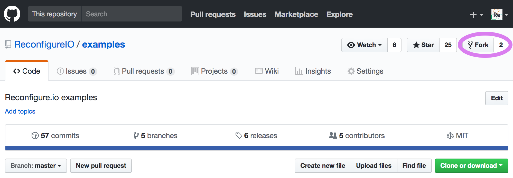

.. _addition:

Tutorial 2 – Filling in the Gaps
================================================
.. admonition:: Make sure you're up to date.

    Run ``reco version`` to check you are running the latest version: |reco_version|. If you need to update, please run ``reco update``, or if your current version is below ``v0.5.0`` see our :ref:`install/update instructions <install>`.

In this tutorial you will complete the code for one of our example programs and find any errors in your code using ``go test`` and ``reco check``. You will then simulate the code running on an FPGA using ``reco sim``. The last tutorial was all about workflow, so now we're taking the first step towards writing and debugging your own programs.

**We'll look at pretty much the simplest calculation possible – adding two numbers together. First, we will look at the problem, discuss how to design the program, and then, once you've had a go at filling in the gaps in the code, you can check the code for compatibility with our compiler and simulate it how it would run on an FPGA to find any errors. Then, we'll look at our full code solution.**

This tutorial assumes you have already run through our first tutorial: :ref:`demo`.

What's the problem?
-------------------
We want the FPGA to take two integers, 1 and 2, add them together and send the result back to us. As you saw in our first example, there's a host CPU which works with the FPGA, with communication happening across a control interface. So, the first thing we need to do is decide what each element needs to do, and when. Then we can write some Go code to tell the host CPU how to communicate with the FPGA, as well as some Go code to program the FPGA to carry out the required tasks.

Let's break this process down. There are just two operands involved so the host can pass them straight to the FPGA along with an address at which to store the result. Then, the FPGA can add the numbers together and write the result back. The host can read the result and print it for us to see. A flow diagram could look like this:

.. figure:: AdditionDiagram.png
   :width: 90%
   :align: center

   Addition flow diagram

Fork our tutorials repository
---------------------------------
We're now going to start using our tutorial materials repo, which contains an incomplete example for you to work on. So, as we're going to be making changes to the code, let's fork the repo. You'll find it |tutorials|.

First, click the **fork** button towards the top right of the screen.

You will be asked to authorize the fork being placed into your account. Then, using the instructions for your operating system below, clone your fork to your local machine:

Linux/MacOSX
^^^^^^^^^^^^
From a terminal create an environment variable for your github username (substitute ``<username>`` for your github username):

.. code-block:: shell

    export GITHUB_USERNAME=<username>

Then copy and paste the following:

.. subst-code-block:: shell

    git clone https://github.com/$GITHUB_USERNAME/tutorials.git $GOPATH/src/github.com/$GITHUB_USERNAME/tutorials
    cd $GOPATH/src/github.com/$GITHUB_USERNAME/tutorials
    git remote add upstream git://github.com/ReconfigureIO/tutorials.git
    git fetch upstream
    git checkout |tutorials_version|

Windows 10
^^^^^^^^^^
From a Powershell terminal create an environment variable for your github username (substitute ``<username>`` for your github username):

.. code-block:: shell

    $env:GithubUsername="<username>"

Then copy and paste the following:

.. code-block:: shell

    git clone https://github.com/$env:GithubUsername/tutorials.git $Env:GOPATH/src/github.com/$env:GithubUsername/tutorials
    cd $Env:GOPATH/src/github.com/$env:GithubUsername/tutorials
    git remote add upstream git://github.com/ReconfigureIO/tutorials.git
    git fetch upstream
    git checkout v0.1.0

Filling in the gaps
-------------------
Now navigate to ``your-github-username/tutorials/addition-gaps/cmd/test-addition/main.go`` to look at the incomplete code for the host CPU. You will notice some of the code is missing. Using the information given in the comments, along with the flowchart above, you can have a go at filling in the missing sections.

First, as we're going to be editing existing code, let's make a new branch to work on, call it ``fill-gaps``::

  git checkout -b fill-gaps

Here's what needs completing:

* Pass operands and results pointer to the FPGA (**lines 28, 30 and 32**)
* Print the result from the FPGA (**line 48**)
* Create an ``if`` statement to exit if the result from the FPGA does not equal 3 (**lines 51-53**)

Once you have completed this, move on to the incomplete code for the FPGA, located at ``your-github-username/examples/addition-gaps/main.go``, and complete the following sections:

* Specify the operands and result pointer (**lines 24-26**)
* Perform the addition (**line 40**)

Once you've made your changes you can stage and commit them to your ``fill-gaps`` branch::

  git add main.go && cmd/test-addition/main.go
  git commit -m "code completed"
  git push origin fill-gaps

Test your code
--------------
Now you can test your program for syntax and semantic errors within your Go environment. We've included a test file – ``main_test.go`` which will check that the function ``Add`` at the top of the FPGA code does what's it's supposed to. So, let's test that first. Make sure you're in ``your-github-username/tutorials/addition-gaps`` and run ``go test``. All being well you should see something like::

  $ go test
  PASS
  ok  	github.com/your-github-username/tutorials/addition-gaps	0.007s

If there are any errors in your code they will be flagged up here for you to fix. A pass tells us that your code is compatible with the Go compiler, and the ``ADD`` function does what we're expecting.

Next navigate to ``your-github-username/tutorials/addition-gaps/cmd/test-addition`` and run ``go test``, and hopefully you'll see::

  $ go test
  PASS
  ok  	github.com/your-github-username/tutorials/addition-gaps/cmd/test-addition	0.007s

If not, you will be able to see where any errors are located. A pass here tells us that your CPU code is compatible with the Go compiler.

Check and then simulate your code
----------------------------------
Now the code is complete and we know it conforms to the Go language, let's check your FPGA code is compatible with the Reconfigure.io compiler. Make sure you are back in ``tutorials/addition-gaps`` and run ``reco check``. Any syntax errors will be flagged up here. All being well you should see::

  $ reco check
  $GOPATH/github.com/your-github-username/tutorials/addition-gaps/main.go checked successfully

Next, once you have dealt with any errors, use our hardware simulator to test how your code will run on the FPGA. First, create a project to work within and set it to be active::

  reco project create addition
  reco project set addition

Now you can start a simulation by running ``reco sim run test-addition``::

  $ reco sim run test-addition
  preparing simulation
  done
  archiving
  done
  uploading
  done
  running simulation

  status: QUEUED
  Waiting for Batch job to start
  status: STARTED
  Beginning log stream for simulation 74c620cf-8fe0-4500-8a6f-fac0fa03edc2
  ...
  3

.. admonition:: Getting in the queue

    Simulation should normally only take around 5 minutes but could be up to 30 minutes depending on what else is in the queue.

For more detailed descriptions of any error messages you might receive here, you can take a look at our troubleshooting section: :ref:`errors`.

See how we did it
--------------------
Now you can take a look at our full example to see if there are any differences between our code and yours, you can find it in the ``examples`` repo you cloned in the previous tutorial. It's always a good idea to check you have the most up-to-date version of our examples, so, first, open a terminal and navigate to ``$GOPATH/src/github.com/Reconfigureio/examples`` and run::

    git describe --tags

If you have a version other than |examples_version|, please run

.. subst-code-block::

    git fetch
    git checkout |examples_version|

Here's the host code with the missing sections highlighted:

.. code-block:: Go
   :linenos:
   :emphasize-lines: 28, 30, 32, 48, 51, 52, 53

     package main

     import (
       "encoding/binary"
       "fmt"
       "github.com/ReconfigureIO/sdaccel/xcl"
       "os"
     )

     func main() {
       // Allocate a world for interacting with the FPGA
       world := xcl.NewWorld()
       defer world.Release()

       // Import the compiled code that will be loaded onto the FPGA (referred to here as a kernel)
       // Right now these two idenitifers are hard coded as an output from the build process
       krnl := world.Import("kernel_test").GetKernel("reconfigure_io_sdaccel_builder_stub_0_1")
       defer krnl.Release()

       // Allocate space in shared memory for the FPGA to store the result of the computation
       // The output is a uint32, so we need 4 bytes to store it
       buff := world.Malloc(xcl.WriteOnly, 4)
       defer buff.Free()

       // Pass the arguments to the kernel

       // Set the first operand to 1
       krnl.SetArg(0, 1)
       // Set the second operand to 2
       krnl.SetArg(1, 2)
       // Set the pointer to the result address in shared memory
       krnl.SetMemoryArg(2, buff)

       // Run the FPGA with the supplied arguments. This is the same for all projects.
       // The arguments ``(1, 1, 1)`` relate to x, y, z co-ordinates and correspond to our current
       // underlying technology.
       krnl.Run(1, 1, 1)

       // Create a variable for the result from the FPGA and read the result into it.
       // We have also set an error condition to tell us if the read fails.
       var ret uint32
       err := binary.Read(buff.Reader(), binary.LittleEndian, &ret)
       if err != nil {
         fmt.Println("binary.Read failed:", err)
       }

       // Print the value we got from the FPGA
       fmt.Printf("%d\n", ret)

       // Check the result is correct and if not, return an error
       if ret != 3 {
         os.Exit(1)
       }
     }

And here's the FPGA code:

.. code-block:: Go
   :linenos:
   :emphasize-lines: 24, 25, 26, 40

    package main

    import (
    //  Import the entire framework for interracting with SDAccel from Go (including bundled verilog)
    _ "github.com/ReconfigureIO/sdaccel"

    // Use the new AXI protocol package for interracting with memory
    aximemory "github.com/ReconfigureIO/sdaccel/axi/memory"
    axiprotocol "github.com/ReconfigureIO/sdaccel/axi/protocol"
    )

    // function to add two uint32s
    func Add(a uint32, b uint32) uint32 {
    return a + b
    }

    func Top(
    // The first set of arguments to this function can be any number
    // of Go primitive types and can be provided via `SetArg` on the host.

    // For this example, we have 3 arguments: two operands to add
    // together and an address in shared memory where the FPGA will
    // store the output.
    a uint32,
    b uint32,
    addr uintptr,

    // Set up channels for interacting with the shared memory
    memReadAddr chan<- axiprotocol.Addr,
    memReadData <-chan axiprotocol.ReadData,

    memWriteAddr chan<- axiprotocol.Addr,
    memWriteData chan<- axiprotocol.WriteData,
    memWriteResp <-chan axiprotocol.WriteResp) {

    // Since we're not reading anything from memory, disable those reads
    go axiprotocol.ReadDisable(memReadAddr, memReadData)

    // Add the two input integers together
    val := Add(a, b)

    // Write the result of the addition to the shared memory address provided by the host
    aximemory.WriteUInt32(
      memWriteAddr, memWriteData, memWriteResp, false, addr, val)
    }

What's next?
-------------
Now you've had a go at writing some code for yourself, let's move on to :ref:`structure` to look in more detail at how we share data between the host CPU and FPGA, and we'll build on a project template to create another simple program.

.. |tutorials| raw:: html

   <a href="https://github.com/ReconfigureIO/tutorials" target="_blank">here</a>
