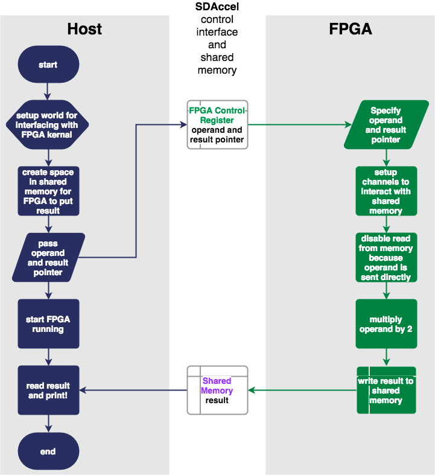

.. _structure:

Tutorial 3 – Structure and Communication
=========================================
.. admonition:: Make sure you're up to date.

    Run ``reco version`` to check your installation. Our current version is |reco_version|. If you need to update run ``reco update`` or see our :ref:`install/update instructions <install>`.

In this tutorial we're going to cover structuring your programs and writing effective Go code for FPGAs. We'll look at our template, which is available for you to use as the basis for new programs, and use it to complete a couple of examples. Along the way we'll learn a bit more about the shared memory available on the FPGA card. **There are some elements that need to be present in your code to keep our compiler happy, and there are some areas where you're free to move and process data however you want. Also, we're not just dealing with an FPGA in isolation, Reconfigure.io programs include code for a host CPU as well as the FPGA, so you need to consider how best to split up the work between the two, and how to pass data around effectively, for more on this see our** :ref:`style guide <organization>`.

What we will do
------------------------
* Look at general program structure
* A detailed look at the basic requirements for the CPU and FPGA code. A template is available in ``tutorials/template``
* Discuss how to share data between the host CPU and FPGA
* Use our template to create a simple program in which a single integer is passed from host CPU to the FPGA, multiplied by 2, and passed back to the host. (If you would rather just look at the solution, it's here: ``tutorials/multiply1``)
* Use the code above as the basis to create another program where an array of 10 integers is passed from the host to the FPGA, each integer is then multiplied by 2 and the resulting array is passed back to the host. (Again, if you would rather just look at the solution, it's here: ``tutorials/multiply-array``)

Program Structure
-----------------
Reconfigure.io programs all have the same structure, a main.go file for the FPGA and then a ``cmd/test`` directory containing the code for the CPU, we call the host code a **command**. You can have multiple host commands within the same program. When you come to simulate or deploy a build image you can choose which host command to use by using the name of the directory it sits within, for example, to simulate the program below, running the benchamarking command, you would navigate to the ``my-program`` directory and run ``reco sim run bench-my-program``. ``reco.yml`` contains a few simple settings for memory access, you just need to specify how many read and write ports you need from the FPGA to shared memory::

  My-Program
  ├── cmd
  │   └── test-My-Program
  │       └── main.go
  ├── main.go
  ├── main_test.go
  ├── reco.yml

Next, we'll look at the structure of the two ``main.go`` files.

The CPU
--------
The host code can be really flexible. Using our subset of Go, you can structure the code to fit your specific requirements.

The host's jobs include to creating, receiving, managing and organizing data for the FPGA to process. The host also starts the FPGA running.

There are a few elements that need to be included in your host code:

* A ``world`` needs to be set up for managing the FPGA so it can work correctly and clean up when the work is done. For more information on this, see the ``world`` entry in our |FPGA|.
* Set aside some space in shared memory for the FPGA to collect and deposit data as required.
* Pass data to the FPGA – input data, pointers to input data, a pointer to where you want the results to end up, maybe an expected length if you are passing an array etc.
* Set the FPGA running.

Here's a template::

  package main

  import (
    encoding/binary

    "github.com/ReconfigureIO/sdaccel/xcl"
  )

  func main() {
    // Allocate a 'world' for interacting with the FPGA
    world := xcl.NewWorld()
    defer world.Release()

    // Import the compiled code that will be loaded onto the FPGA (referred to here as a kernel)
    // Right now these two identifiers are hard coded as an output from the build process
    krnl := world.Import("kernel_test").GetKernel("reconfigure_io_sdaccel_builder_stub_0_1")
    defer krnl.Release()

    // Allocate a space in the shared memory to store the data you're sending to the FPGA and space
    // for the results from the FPGA
    inputBuff := world.Malloc(xcl.ReadOnly, <size here>)
    defer inputBuff.Free()

    outputBuff := world.Malloc(xcl.WriteOnly, <size here>)
    defer outputBuff.Free()

    // Create/get data and pass arguments to the FPGA as required. These could be small pieces of data,
    // pointers to memory, data lengths so the FPGA knows what to expect. This all depends on your project.
    // Usually, you will send data via shared memory, so you will need to write it to the space you allocated
    // above before passing the pointer to the FPGA.
    // We have passed three arguments here, you can pass more as neccessary

    // First argument
    krnl.SetArg(0, <first>)
    // Second argument
    krnl.SetArg(1, <second>)
    // Third argument
    krnl.SetMemoryArg(2, <third>)

    // Run the FPGA with the supplied arguments. This is the same for all projects.
    // The arguments ``(1, 1, 1)`` relate to x, y, z co-ordinates and correspond to our current
    // underlying technology.
    krnl.Run(1, 1, 1)

    // Display/use the results returned from the FPGA as required!

  }

The FPGA
-----------
The code for the FPGA should follow the same general structure for all projects. You'll notice we use ``func Top``, which is a requirement of our compiler:

* Specify the data that needs processing, either directly if it's just a few arguments, or by location if it's in shared memory - Our compiler relates this directly to the arguments sent over from the host as shown above.
* Specify where the FPGA should put its results.
* Set up ports so the FPGA can interact with the shared memory for collecting and returning data.
* Tell the FPGA what to do with the data - the important bit!
* Send results to shared memory.

Here's a template::

  package main

  import (
    // import the entire framework (including bundled verilog)
    _ "github.com/ReconfigureIO/sdaccel"

    // Use the SMI protocol package for interacting with shared memory
    "github.com/ReconfigureIO/sdaccel/smi"
  )

  func Top(
    // Specify inputs and outputs to and from the FPGA. Tell the FPGA where to find data in shared memory, what data type
    // to expect or pass single integers directly to the FPGA by sending them to the control register - see examples

    ...

    // Set up ports for interacting with the shared memory, here we have 2 SMI ports which can be used to read or write
    readReq chan<- smi.Flit64,
    readResp <-chan smi.Flit64,

    writeReq chan<- smi.Flit64,
    writeResp <-chan smi.Flit64) {

    // Read data in if required

    smi.ReadUInt32(
      readReq, readResp, <address_to_read_from>, smi.DefaultOptions, <where_to_write_it_to>
    )

    // Do whatever needs doing with the data from the host

    ...

    // Write the result to the location in shared memory as requested by the host
    smi.WriteUInt32(
      writeReq, writeResp, <address_to_write_to>, smi.DefaultOptions, <data_to_write>)
  }

Passing data around
--------------------
Data is shared between the host and FPGA using shared memory. Some arguments can be passed directly to the FPGA via its control register: This is most useful for passing memory addresses and data lengths. Small amounts of data can be passed this way but the usefulness is really limited – there isn't much space and it's slow to access. In most situations the host should place data into shared memory, and then pass a pointer to the location of that data to the FPGA.

Host CPU code
^^^^^^^^^^^^^
We can use a simple example of passing a small array from the host CPU to the FPGA and then have the FPGA send it back again. Starting with the code for the CPU, we need a |world| to interact with the FPGA and talk to the shared memory on the FPGA card. We can create space within shared memory for specific purposes and send pointers to these memory locations to the FPGA so it knows where to look for our data, and where to store its results.

Sending data from the host to the FPGA is a three step process:

1. Create space in memory for our data
2. Store data in that memory location
3. Pass the memory location to the FPGA so it knows where to find it

For this simple back and forth example we need to create our test data first, so let's make an array of 10 incrementing values, we'l call it ``input``::

      input := make([]uint32, 10)

      for i, _ := range input {
    		input[i] = uint32(i)
    	}

The code snippets for passing our test data to the FPGA look like this (remember these are out of context, please refer to the template above for the bigger picture):

1. Create space in memory of the right size for our data, we need space to hold the data on its way to the FPGA and on its way back::

      inputBuff := world.Malloc(xcl.ReadOnly, uint(binary.size(input)))
      defer inputBuff.Free()

      outputBuff := world.Malloc(xcl.ReadOnly, uint(binary.size(input)))
      defer inputBuff.Free()

2. Write the data to the input memory location::

      binary.Write(inputBuff.Writer(), binary.LittleEndian, &input)

3. Send the memory locations and the size of the input data to the FPGA, we do this by setting arguments. These arguments are converted by our compiler into inputs to the FPGA::

      krnl.SetMemoryArg(0, inputBuff)
      krnl.SetMemoryArg(1, outputBuff)
      krnl.SetArg(2, uint32(len(input)))

FPGA code
^^^^^^^^^^
The FPGA interacts with shared memory using the |smi| protocol. In the template above you can see we set up SMI ports for interacting with shared memory within the ``Top`` function in the FPGA code.

There are three steps to the FPGA getting hold of the sample array:

1. Receive the memory location from the host
2. Create a variable for the data
3. Use an |smi read| to read the data into that variable (at which point it will be located within the on-chip block RAM)

Here are the code snippets for these steps:

1. Receive the memory locations and data size from the host (the ``0``, ``1`` and ``2`` in ``krnl.SetMemoryArg...`` are translated by our comiler to be the first, second and third inputs to the FPGA)::

      inputData uintptr,
      outputData uintptr,
      length uint32,

2. Create a variable called ``data`` to hold the input data, this will be located within the FPGA's block RAM::

      data := make([]uint32, length)

3. Read the data from shared memory into the array ``data`` using an |smi read burst|::

      smi.ReadBurstUInt32(
        readReq, readResp, inputData, smi.DefaultOptions, length, data)

Now the FPGA has our array held within ``data``, let's send it back again. The process for getting data from the FPGA's block RAM to the reserved space in shared memory is an |smi write burst| as follows::

      smi.WriteBurstUInt32(
        writeReq, writeResp, outputData, smi.DefaultOptions, length, data)

Back to the CPU code
^^^^^^^^^^^^^^^^^^^^
Now, moving back to the host CPU code, the host can collect the output data from shared memory and place it into a new variable ``output``::

      output := make([]uint32, len(input))
      binary.Read(outputBuff.Reader(), binary.LittleEndian, &output)

We have just followed an array from the CPU to the FPGA and back again using shared memory.

Let's write some code
----------------------
To explore these methods of passing data around further, let's use our template to write a very simple program to pass one integer to the FPGA from the host and tell the FPGA to multiply this integer by 2 and pass it back to the host. **As we're passing a single integer, the host can pass this straight to the FPGA's control register but the route back from the FPGA to the CPU is always via the shared memory**. As we have done in previous tutorials, lets first look at a flow diagram for this example:

We can use our template to write the code to perform this multiplication. First, let's check you're using the latest version of our tutorial materials – |tutorials_version|. Open a terminal and navigate to where you cloned your fork of our tutorial materials (probably ``$GOPATH/src/github.com/<your-github-username>/tutorials``) and run::

    git describe --tags

If you have a different version, please run

.. subst-code-block::

    git fetch upstream
    git pull upstream master
    git checkout |tutorials_version|

We're going to be editing and adding to our template now so let's make a new branch to work on, call it ``multiply``::

  git checkout -b multiply

Now we can duplicate ``template`` and rename it for this simple example::

  cp -r template multiply1
  cd multiply1/cmd
  mv test test-multiply1

So now you should have something like this::

    multiply1
    ├── README.md
    ├── cmd
    │   └── test-multiply1
    │       └── main.go
    ├── glide.yaml
    ├── main.go
    ├── main_test.go
    ├── reco.yml
    └── vendor
      └── ...

Let's work on the host CPU code first. Open ``multiply1/cmd/test-multiply1/main.go`` in your chosen editor. Have a go at editing the template host code to do what's needed for the single integer multiplication described above. Here are some pointers:

* We're only passing one integer straight to the control register so we only need to make space in shared memory for the result from the FPGA, not the data we're sending *to* the FPGA.
* We only need to send two arguments to the FPGA: the integer to be used in the multiplication and the pointer to where we want the FPGA to store the result.
* Use the Go package |binary| to read the result back from shared memory and store it into a variable ready to print.
* Use the Go package |log| to print your result!

Now, open ``multiply1/main.go`` and write the FPGA code to complete the simple multiplication. Here are some pointers:

* Just two inputs to the FPGA need specifying, the integer to be multiplied and the pointer to where we're going to store the result.
* We just need one smi write port as we won't be reading anything from shared memory – remember to change the number of ports in the ``reco.yml`` file to ``1``.
* All that's left is to do the multiplication. Create a simple 'multilply by 2' function *outside* the ``Top`` function, call it ``Multiply``. You can call your ``Multiply`` function from within ``Top``. This may seem a bit of a complex way to multiply by 2 but it will allow us to test the code in our local Go environment. Then use the |smi write| package to write the result to the correct location in shared memory so it can be picked up by the host.

Next you need to write a test file so you can test this code in your Go environment. Here is some information on creating a test suite |tests|, and a stripped-back ``main_test.go`` file is included in our template. You just need to edit the template test file (``multiply1/main_test.go``) to check that the ``Multiply`` function you created in your FPGA code above actually multiplies its input by 2.

Once you're happy with your code, let's commit those changes and push them to your ``multiply`` branch on github. First make sure you're in ``tutorials/multiply1`` and then run::

  git add main.go && cmd/test-multiply1/main.go
  git commit -m "multiply1 completed"
  git push origin multiply

Test your code
^^^^^^^^^^^^^^^
Now you can test your code in your local Go environment. Make sure you're in the top directory of your project ``$GOPATH/src/github.com/<your-github-username>/tutorials/multiply1`` and run ``go test``. If all is well with your FPGA-side code you should see::

  $ go test
  PASS
  ok  	github.com/ReconfigureIO/tutorials/multiply1	0.007s

Next you can head over to your host code ()``$GOPATH/src/github.com/<your-github-username>/tutorials/multiply1/cmd/test-multiply1/main.go``) and check it builds with the Go compiler by running ``go build``.

Check and simulate
^^^^^^^^^^^^^^^^^^^
Now we're going to use ``reco`` to check the code you have written is compatible with the Reconfigure.io compiler, and then we'll simulate your code. First, let's create a project to work within::

  reco project create multiply1
  reco project set multiply1

To type-check your code for compatibility with our compiler, make sure you're in the ``tutorials/multiply1`` directory and run ``reco check``. If everything is ok, you should see::

  $ reco check
  GOPATH/src/github.com/<your-github-username>/tutorials/multiply1/main.go checked successfully

Once you've addressed any errors here, you can simulate how your code will run on an FPGA::

  $ reco sim run test-multiply1
  (.....)
  The result from the FPGA is: 2

Once the compiler has run through the simulation, you should see the multiplication result displayed. When you're done, you can compare your code with ours, which you'll find here: ``tutorials/multiply1/``

More data
------------
In that last example, as we only needed to pass a single argument from host to FPGA, we sent it straight to the FPGA's control register. This time, we're going to pass an array, so we'll send it via shared memory.

.. figure:: images/StructureDiagram2.png
    :width: 90%
    :align: center

You can use the code you created above as the basis for this and just make the changes required to pass more data. So, duplicate the ``multiply1`` directory and rename it to ``multiply-array``::

  cp -r multiply1 multiply-array
  cd multiply-array/cmd
  mv test test-multiply-array

You should have something like this::

  multiply-array
  ├── README.md
  ├── cmd
  │   └── test-multiply-array
  │       └── main.go
  ├── glide.yaml
  ├── main.go
  ├── main_test.go
  ├── reco.yml
  └── vendor
    └── ...

Open the host code ``multiply-array/cmd/test-multiply-array/main.go`` and edit to follow the new structure described by the flow diagram above. Here's some pointers:

* For this example we need two memory locations, one for the input array, and one for the output. When passing these over to the FPGA we also need to specify the length.
* You will need to create the data to send to the FPGA – an array of 10 integers and seed it with incrementing values (0-9).
* As in the last example you can use the |binary| package to write your input data to memory.
* This time the variable to hold the result will need to be an array of the length of the input array
* Use the |log| package to display the results.

Then, open ``multiply-array/main.go`` and edit the FPGA code to follow this example. Here's some pointers.

* This time there are three inputs to the FPGA to specify: pointers to input and output data and the data length
* You need an smi read port this time, as we'll be reading the input from shared memory. Also, remember to change the number of ports required to ``2`` in teh project's ``reco.yml`` file.
* Now, we can read the input array into a channel using an |smi read burst|. First, make a channel, call it ``inputChan``, and then use a read burst to populate it with the input data. You can put this inside a goroutine so the reading in can happen at the same time as processing the data.
* Then, create a channel for the transformed data, call it ``transformedChan``, and create a goroutine with a for loop inside to multiply each integer in ``inputChan`` by 2 and send it to ``transformedChan``. You can use your ``Multiply`` function from the last example for this.
* All that's left to do now is send the contents of ``transformedChan`` back to the results space in shared memory using a |smi write burst|.

Once you're happy with your code, let's commit those changes and push them to your ``multiply`` branch on github. First make sure you're in ``tutorials/multiply1`` and then run::

  git add main.go && cmd/test-multiply-array/main.go
  git commit -m "multiply array completed"
  git push origin multiply

Test your code
^^^^^^^^^^^^^^^
As you have used the same multiplication function as you used for the previous example, you can use the same test file to test your code too. So let's do that next. Make sure you're in the top directory of your project ``$GOPATH/src/github.com/<your-github-username>/tutorials/multiply-array`` and run ``go test``. If all is well you should see::

  $ go test
  PASS
  ok  	github.com/ReconfigureIO/tutorials/multiply-array	0.007s

Next head to the host-side code (``tutorials/multiply-array/cmd/test-multiply-array``) and check the code with the Go compiler by running ``go build``

Check and simulate
^^^^^^^^^^^^^^^^^^^
Now we're moving over the Reconfigure.io tooling we need to create a project for this example, let's call it multiplyArray::

  reco project create multiplyArray
  reco project set multiplyArray

You can now type-check your code for compatibility with our compiler. From the ``multiply-array`` directory enter ``reco check``, and hopefully you'll see::

  $ reco check
  GOPATH/src/github.com/<your-github-username>/tutorials/multiply1/main.go checked successfully

Once you've addressed any errors here you can simulate how your code will run on an FPGA::

  $ reco sim run test-multiply-array
  (.....)
  The result from the FPGA is: 024681012141618

Once the compiler has run through the simulation, you should see the contents of the result array. Once you're done, you can compare your code with ours, as before.

What have we done
------------------
In this tutorial we have looked at how to structure your code to work with Reconfigure.io, and how to use our template as a basis for writing new programs. Also, we've seen how to pass arguments straight from the host to the FPGA using the control register, and pass data from the host to the FPGA via shared memory, and back again. Next, :ref:`tutorial 4 <graphstutorial>` shows you how to use dataflow graphs to optimize your FPGA code.

.. |FPGA| raw:: html

   <a href="http://godoc.reconfigure.io/v0.12.7/host/pkg/xcl/index.html#World" target="_blank">FPGA interface docs</a>

.. |world| raw:: html

   <a href="http://godoc.reconfigure.io/v0.12.7/host/pkg/xcl/index.html#World" target="_blank">World</a>

.. |smi| raw:: html

   <a href="https://godoc.org/github.com/ReconfigureIO/sdaccel/smi" target="_blank">SMI</a>

.. |binary| raw:: html

   <a href="https://golang.org/pkg/encoding/binary/" target="_blank">binary</a>

.. |log| raw:: html

   <a href="https://golang.org/pkg/log/" target="_blank">log</a>

.. |tests| raw:: html

  <a href="https://golang.org/pkg/testing/" target="_blank">here</a>

.. |smi read burst| raw:: html

   <a href="https://godoc.org/github.com/ReconfigureIO/sdaccel/smi#ReadBurstUInt32" target="_blank">SMI read burst</a>

.. |smi write burst| raw:: html

    <a href="https://godoc.org/github.com/ReconfigureIO/sdaccel/smi#WriteBurstUInt32" target="_blank">SMI write burst</a>

.. |smi write| raw:: html

    <a href="https://godoc.org/github.com/ReconfigureIO/sdaccel/smi#WriteUInt32" target="_blank">SMI write</a>

.. |smi read| raw:: html

   <a href="https://godoc.org/github.com/ReconfigureIO/sdaccel/smi#ReadUInt32" target="_blank">SMI read</a>
