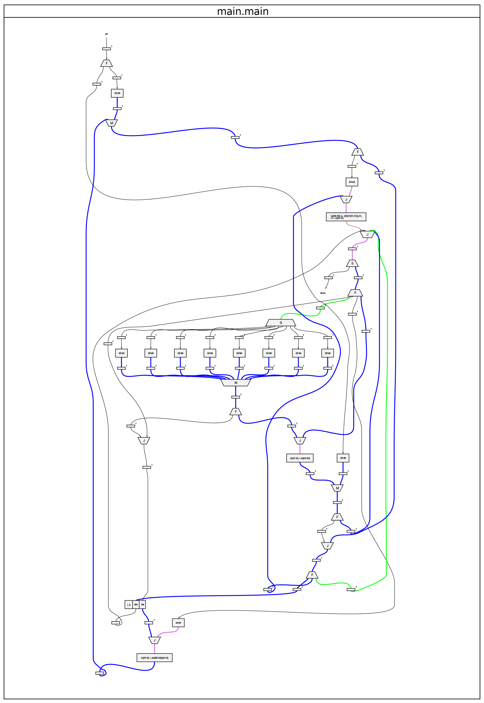
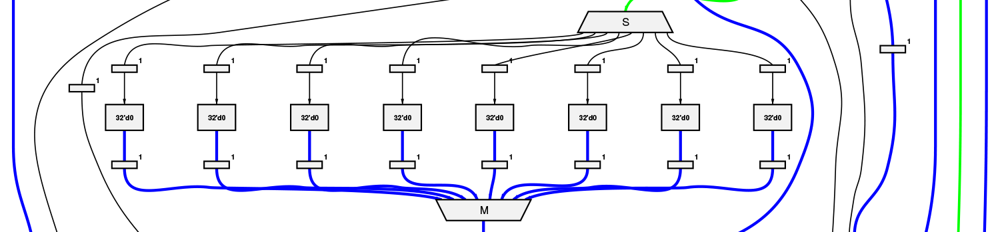
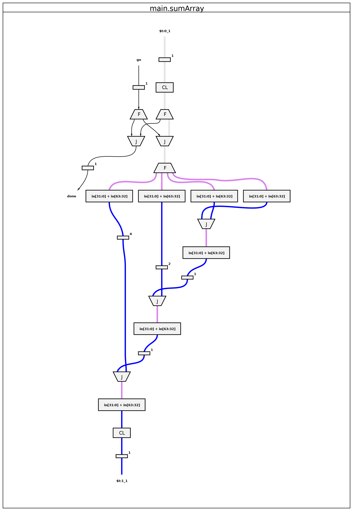

.. _graphstutorial:

Tutorial 4 – Using Graphs for Optimization
================================================
.. admonition:: Make sure you're up to date.

    Run ``reco version`` to check if your installation in up-to-date. Our current version is |reco_version|. If you need to update, please head :ref:`here <install>` before moving on to the tutorial.

In this tutorial we will look at using dataflow graphs to optimize your code. We'll take a simple function that adds up some numbers using a for loop, generate its dataflow graph, and identify ways to improve performance.

**The use of dataflow graphs for code optimization is an experimental feature, purely for use during this alpha development phase. It’s quite a complex process but gives an interesting insight into how Reconfigure.io works. We're currently working on automating this optimization stage, at which point, graph generation will no longer be part of our workflow.**

Why use graphs?
---------------
Our compiler takes your code through several processes to get it into a suitable format for programming an FPGA. The first step is to convert it to a language called `Teak <http://apt.cs.manchester.ac.uk/projects/teak/>`_.

Teak is a hardware description dataflow language, designed to be easily translated into other hardware description languages. What sets Teak apart from other forms is that it is displayed as a graph rather than a sequential list of instructions. In the Teak model, each node in the graph is an independent process operating on data flowing through the `edges <https://en.wikipedia.org/wiki/Graph_theory>`_. What this gives us is a model of computation that is parallel by default, where sequential dependencies are expressed via dataflow. Teak graphs give us a representation of how our Go code will be translated onto the FPGA circuitry. This is very valuable because, at the two ends of the process, the solution looks very different.

**So, our goal is to write concurrent Go code to take advantage of the FPGA's parallel hardware, and we can use Teak graphs to identify where this parallelism can be increased by changing the way the original code is structured.**

How are they structured?
-----------------------
Teak graphs can be many pages long, with a page for each function used in your code. The complexity of each page depends on the complexity of the function. Here's an example, it's the graph for the ``axi/memory.WriteUInt32`` function in our addition example:

.. figure:: graph_addition_writeuint32.png
    :align: center
    :width: 100%

    Dataflow representation of the axi/memory.WriteUInt32 function

.. note::
   ``reco graph gen`` will generate content for every function that reaches our compiler, so some pages in the output may be for functions you haven't used.

There are various node types, which we will look at below, connected by lines of varying color. The black lines represent control circuits, stop, go etc., so there's no data flowing there. The colored lines distinguish unique data widths.

Each node has *ports* for connectivity. Input *ports* are at the top and output *ports* at the bottom. Some node types will have multiple inputs or outputs depending on their function.

Node types
^^^^^^^^^^
**Operator** – The most fundamental node type is the *operator*, which is responsible for operating on data. Anywhere you would use an arithmetic or logical operator in Go, you can expect it to be represented as an *Operator* node in Teak.

.. figure:: operator.png
   :align: center
   :width: 40%

**Latch** – A *latch* is inserted in the Teak model to break up operations into manageable chunks for the FPGA circuitry. A latch introduces a 1 clock delay into the system. Latches hold data, allowing *operators* to pass data between each other.

.. figure:: Latch.png
   :align: center
   :width: 40%

**Fork** – A *fork* indicates a split in the circuit. Forks are important for concurrency, because they can pass data to two or more nodes at the same time.

.. figure:: Fork.png
   :align: center
   :width: 40%

**Join** – A *join* shows where data/control paths are synchronized and concatenated.

.. figure:: Join.png
   :align: center
   :width: 40%

**Steer** – A *steer* takes a single input and sends to multiple outputs, choosing based on the input control value assigned to the data. They act as data-dependent de-multiplexers.

.. figure:: Steer.png
   :align: center
   :width: 40%

**Merge** – A *merge* multiplexes multiple, concurrent input data or control streams on a first-come-first-served basis.

.. figure:: Merge.png
   :align: center
   :width: 40%

**Arbitrate** – An *arbiter* uses a scheduling algorithm to decide the order it passes on its independent inputs.

.. figure:: Arbitrate.png
   :align: center
   :width: 40%

Let's get started
-----------------
First let's check you've got the most up-to-date version of our examples repo by running::

    cd $GOPATH/src/github.com/ReconfigureIO/examples
    git checkout v0.4.2

So, let's take a single function that takes an array of 8 integers and sums them together using a for loop::

  package main

  func main() {
      var array [8]int
      sum := 0
      for i := 0; i < 8; i++ {
          sum = array[i] + sum
      }
  }

Create a folder for this tutorial somewhere on your local machine, call it ``tutorial3``. Create another folder within that and call it ``bad_example``. Copy the snippet above into your text editor and save it into your ``bad_example`` folder, calling it ``main.go``.

Generate a graph
-----------------
Now we can use ``reco`` to generate a graph for this function. Open a terminal and navigate to ``tutorial3/bad_example``, then generate the graph using ``reco graph gen``::

  $ reco graph gen
  preparing graph
  done. Graph id: <graph_ID>
  archiving
  done
  uploading ...
  done
  <graph_ID>

Copy the unique graph ID to open the graph::

  reco graph open <graph_ID>

It should look like this:

So, looking at the graph, you can see it's pretty complex, there's a lot going on. But if we simply try to trace the various branches from ``go`` (at the top) to ``done`` (middle, right hand side), you can see that some of the branches are long and have quite a few nodes, including several latches, which increase the time the whole thing takes. And due to the use of a ``for`` loop in the code, some of these branches are looping too.

A sign of good parallelism is when a graph is wide, with multiple unconnected operations appearing horizontally. So, in this example, the only really parallel bit is in the middle, which corresponds to where the array is accessed in the code:

If we used this code to program an FPGA, we would not be making good use of it's parallelism. What we need to do is think of ways to change the original code to make better use of the parallel circuitry.

More parallelism
----------------
Taking away the for loop and summing the bits of the array together, in one go, is a good way to do this. Let's try that and see what the graph looks like::

  package main

  func main() {
      var array [8]int
      sum := array[0] + array[1] + array[2] + array[3] + array[4] + array[5] + array[6] + array[7]
  }

Create a new folder in ``tutorial3`` called ``good_example``. Copy the snippet above into your text editor, call it ``main.go`` and save it in your ``good_example`` folder. From a terminal, navigate to ``tutoria3/good_example`` and use ``reco graph gen`` to generate the graph::

  $ reco graph gen
  preparing graph
  done. Graph id: <graph_ID>
  archiving
  done
  uploading ...
  done
  <graph_ID>

Copy the unique graph ID to open the graph::

  reco graph open <graph_ID>

As you can see, it's a lot clearer what's going on here, you can see the first two integers being summed together, and then the next being added to that, and so on. Clarity is usually a good sign that the code design is good for achieving parallelism. There are clear branches flowing from ``go`` to ``done``.

Optimizing your own code
-------------------------
Analyzing Teak dataflow graphs is complex. For this reason, we suggest that when it comes to optimizing your own code, you should break out small functions from your overall code to see what's going on more easily. Taking the example from our coding style guide: if ``(a * b) + c`` is in an inner loop of your application, breaking it out into the function below will help you see its performance in isolation as it will appear as a separate page in the graph output::

  func MultiplyAndAdd(a uint, b uint, c uint) uint {
     return (a * b) + c
  }

Once you have optimized these smaller functions you can embed them back into your wider code to improve the overall parallelism of the program.

For early access users, we have a section on our `forum <https://community.reconfigure.io/c/early-access-feedback/optimization-support>`_ where you can post your own generated graphs to get optimization help from the Reconfigure.io team.
