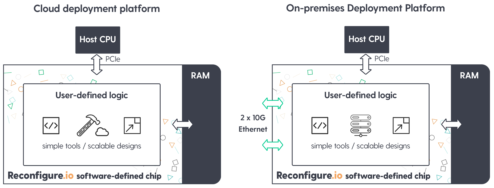

A platform for software defined chips
=====================================
Reconfigure.io is a platform for programming hardware accelerators from software. You can use your existing development tools to write applications in Go, to access the benefits of hardware acceleration – **more performance, lower latency, reduced power and space requirements**. We have both cloud and on-premises platform options, so whatever your situation or use case, we have a platform that will work for you. Our software defined chips are fully reprogrammable and our tooling works in line with modern software development practices – CI&CD, Agile etc. – so you can develop and manipulate accelerator designs along with your current workflow.

Our current platforms are based on FPGAs (field programmable gate arrays), which provide significant latency and throughput improvements when compared to using CPUs alone, by carrying out many, many tasks in parallel. Cost reductions are easily achieved because one FPGA can carry out the work of many servers. Up until now, the power of the FPGA has been tricky to harness due to the skills required to take full advantage of their programmability. Reconfigure.io allows you to use the skills and tools you already have to program and reprogram these chips to create accelerators that fit your business-specific requirements.

.. image:: images/speed-animation.gif
    :align: center
    :width: 70%

Where do I sign up?
-------------------
If you're new to Reconfigure.io and would like to try out our cloud platform for free, please |signup| using your Github account. It'll just take a few minutes and we'll guide you through downloading and :ref:`installing <install>` our command line tool. If you want to know more about our on-premises platform, please contact us at sales@reconfigure.io.

How to use this guide
----------------------
Reconfigure.io provides a comfortable platform for you to use your software development skills to create hardware designs.

For an overview of our workflow from coding to deployment, head :ref:`here <overview>`. Also, checkout our :ref:`project-structure` to see how Reconfigure.io programs are made up, and :ref:`here <optimize>` for information on the various ways of optimizing your programs for the FPGA hardware. To take a high-level look at our system architecture have a look :ref:`here <architecture>`. Or, if tutorials are more your thing:

* You can start off by running through our :ref:`first tutorial <demo>` to see how powerful the Reconfigure.io service is. You will quickly get to grips with our simple workflow using some of our example code to run through development, checking, simulating, building and finally deploying a build image to an FPGA instance.
* Next, our :ref:`second tutorial <addition>` looks at a very simple example and guides you through completing some code for yourself to give you more experience of how our applications are structured.
* Our :ref:`third tutorial <structure>` looks at program structure in more detail, as well as exploring how data is shared between the various elements of the FPGA instance – this puts you in a good position to start writing your own programs.

We have two platform options: on-premises or cloud. Any information in these docs that is specific to a platform will be clearly indicated.

Helpful resources
------------------

Tech support
^^^^^^^^^^^^
You can access technical support from our engineering team at any time, we're always available either:

* on our |forum|
* through our in-app messenger on your |dashboard|

API docs
^^^^^^^^
You will need to use some specific Go packages for talking to memory, and for communication within the FPGA instance. You'll find docs for these |api|.

What's new?
-----------
Here's a rundown of our latests improvements and new feature releases.

.. _llvm:
6th September
^^^^^^^^^^^^^
A beta release of our new compiler, rio, is released. To use the new compiler version for a project, just include the line shown highlighted below in your project's ``reco.yml`` file:

.. code-block:: shell
   :emphasize-lines: 4

    memory_interface: smi
    memory_width: 64
    ports: 1
    compiler: rio

To read more about our reworked compiler, see our |blog|.

28th August
^^^^^^^^^^^
The latest version of our command line tool, ``reco``, includes some new features to help you track your builds and optimize your code:

* A message can be added to a build, like a ``git commit`` message, as follows: ``reco build run -m "helpful message"``. This message is then displayed in your dashboard build list, and the per project build list accessible by running ``reco build list``. This is to help with build management, when you're working on several iterations of a design.
* :ref:`Build reports <reports>` are now available by running ``reco build <build_ID> report``. These reports include information on utilization of FPGA resources for your projects, to help with scaling up and streamlining designs.

**You can view our release notes in full** :ref:`here <release_notes>`**.**

.. |blog| raw:: html

   <a href="https://medium.com/the-recon/reconfigure-io-move-to-llvm-for-major-performance-and-usability-improvements-1f9c36ca424" target="_blank">blog post</a>
.. |signup| raw:: html

   <a href="https://reconfigure.io/sign-up" target="_blank">sign up</a>

.. |forum| raw:: html

   <a href="https://community.reconfigure.io/" target="_blank">community forum</a>

.. |dashboard| raw:: html

   <a href="https://app.reconfigure.io/dashboard" target="_blank">dashboard</a>

.. |api| raw:: html

   <a href="https://godoc.org/github.com/ReconfigureIO/sdaccel" target="_blank">here</a>
